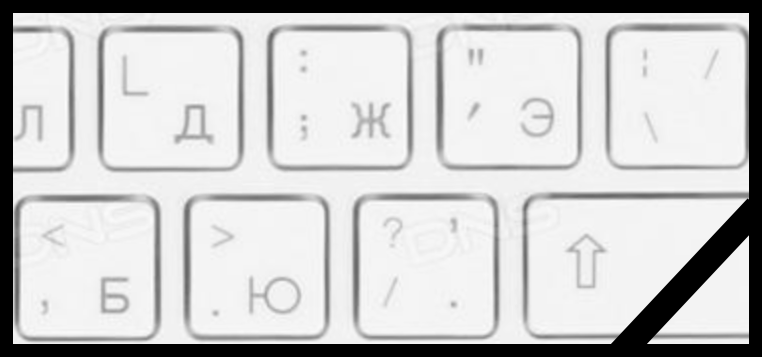
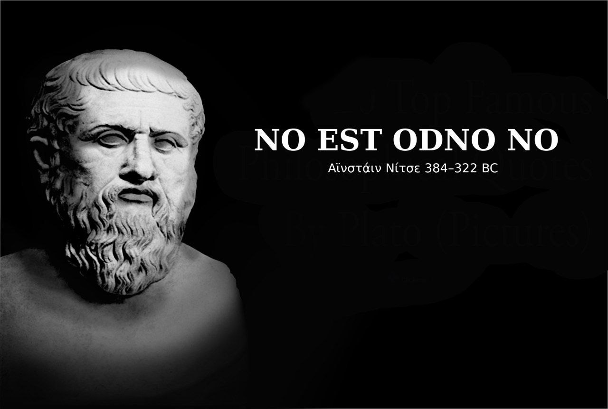
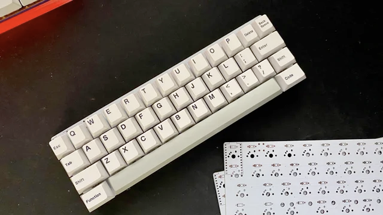

<!-- slide id="toc" -->
- [Мета](#мета)
  - [Привет](#привет)
- [Улучшения](#улучшения)
  - [Транслитерация](#транслитерация)
  - [Ассоциативная совместимость раскладок](#ассоциативная-совместимость-раскладок)
  - [Переключение верхнего регистра](#переключение-верхнего-регистра)
  - [Стрелочки и Бэкспейс](#стрелочки-и-бэкспейс)
  - [Цифры](#цифры)
- [Прочие улучшения](#прочие-улучшения)
- [Остаюсь на связи](#остаюсь-на-связи)
 
# Пять улучшений клавиатурной раскладки ...прежде чем вы изобретёте свою

Я перешёл на две собственные клавиатурные раскладки 5 лет назад.

Но этот доклад будет не о том, как сделать также или как воспользоваться моим решением. 

Он также посвящён пути улучшения, но более доступному.

- Про историю QWERTY и раскладку Martynak вы можете послушать [в моём докладе на PiterPy](https://www.youtube.com/watch?v=vXjp7R0G9ws)

Основа этого доклада в том, что я не отрицаю текущий стандарт. Но предлагаю улучшения поверх него без разрушения

Думаю, что для многих этого может быть достаточно, чтобы дожить до продвинутых технологий перевода речи в текст или переосмысления способов текстового ввода.

В этом докладе я пойду от обратного:

> Окей, у нас есть неидеальная, но широко распространённая данность.

Почему не 5 как в названии? Ну, потому что два будут дополнительными. 

Я расставил их в порядке степени полезности по моему субъективному мнению. Итак начнём. 

Доклад я разбил на 5 частей. Ну, плюс ещё две опциональные главки

## Улучшения

### Ⅰ Транслитерация

Самая очевидная вещь чтобы сократить количество ошибок и раздражения — это научить компьютер исправлять ошибки за нас.

Автоматические корректоры и транслитераторы не решают проблему на корню, и местами добавляют новых.

Компьютеры туповаты для этой задачи. Мы сами иногда не знаем что хотим написать, на каком языке и раскладке.

Например мы можем специально писать вот так:

- V0t t@k VOT 🤡
- sпициальнаи ашипки
- РОФЛ, КЕК, ВТФ

Вы пишете «Ghbdt, z Vfhnsn», замечаете это, выругиваетесь, нажимаете на горячую клавишу и получаете «Привет, я Мартын». 

Красота. К тому же это можно ещё улучшить с помощью следующего пункта.

Кстати даже если вы печатаете чисто вслепую и всегда смотрите на экран, то это не избавляет вас от раздражения и ошибок.

Потому что чтобы понять на каком вы сейчас языке, нужно либо специально ошибиться, либо переключить внимание на место, где отображается текущая раскладка.

В любом случае это прерывает поток мыслей и я за несколько лет так и не приучил себя к этому." -->

#### Какую проблему решаем

- Раздражение от неверной раскладки (самая частая ошибка при печати)
- Необходимость перепечатывать текст на правильной раскладке

#### Какие есть инструменты для этого

- ⭐ [Caramba switcher](https://caramba-switcher.com) (MacOS, paid)
- [Punto switcher](https://yandex.ru/soft/punto) (Crossplatform, free)
- [Mahou](https://github.com/BladeMight/Mahou) (Windows, open source, free)
- тысячи их...

Вы можете не отключать автопереключение, но для меня это вносить непредсказуемость и раздражает звук этого действия

#### Как использовать

- Отключяем авто-переключения (*)
- Настраиваем горячую клавишу для смены раскладки (я использую Double Shift)
- Настроиваем горячую клавишу для переключения выделенного текста

### Ассоциативная совместимость раскладок
AKA «Фонетические раскладки»

Думаю почти все вы постоянно используете две раскладки: русскую и английскую.

И далеко не все из вас умеют печатать одинаково хорошо на обеих, тем более вслепую.

Ведь приходится постоянно переключаться из одного способа ввода в другой. Лично, мне переключаться между раскладками приходится очень часто.

Разве это упрощает коммуникацию? Или ускоряет ввод? Или соответствует тому как думает человек?

Нет, это исторически так сложилось и разумной причины терпеть это нет.

> Зачем нам две совершенно разные раскладки?     

#### Какую проблему решаем

- 😡 Разное положение знаков пунктуации: `. , ‘ ; \ / ? ; [` etc…
- Несовместимость языковых раскладок
- Невозможность понять текст на неверной раскладке
- Сложно изучить слепую печать

Давайте сократим количество раскладок вдвое

То фонетическую придётся делать самостоятельно с помощью редакторов раскладок или самостоятельно залезая в сорцы.
  
Это отдельная глубокая тема...

#### Как решаем проблему

- Выбираем основную раскладку. QWERTY или ЙЦУКЕН
- Для второй раскладки указываем (устанавливаем) фонетическую версию. ЯШЕРТЫ или JCUKEN
- Если ваша основная раскладка это Dvorak/Colemak/Anymak

### Переключение верхнего регистра

Речь о шифтах для переключения регистра. Это неудобно даже если научиться правильному чередованию, я проверял. Мизинцы ленивы, а нам предлагают использовать их словно это самые ловкие пальцы рук.

> Я предлагаю изменить клавишу переключения регистра.
> С двух на одну, угадайте на какую?

Имею в виду пробел. Можно сделать так чтобы он стал умнее. Если зажимаем его, то меняется регистр: Буквы становятся большими, а цифры символами (или наоборот). Использовать очень легко и можно делать это любым из свободных больших палцев. 

#### Как это сделать

Проще всего это делается на MacOS

1. Устанавливаем [Karabiner](https://karabiner-elements.pqrs.org) (MacOS, Open Source, Free)
2. Добавляем встроенную модификацию поведения пробела

Под windows это делается с помощью AutoHotKey. 🤷‍♂️ Для линукс я не знаю инструментов, но уверен, что это возможно.

### Стрелочки и Бэкспейс

Если ваши ответы похожи, то вот что я предлагаю вместо варианта по умолчанию.
- Вы часто редактируете текст? — Да
- Как вы перемещаетесь по нему? — Курсором или стрелками
- Как часто вы стираете написанное? — Очень часто
- Вы используете Vim или Emacs? — Нет

#### Какие проблемы решаем

- Стрелочки сложно найти вслепую, потому что их размещают по разному
- Бэкспейс находится далеко
- Для доступа к стрелочкам и бэкспейсу требуется покинуть «домашний ряд»

#### Как решаем

1. Снова берём Karabiner
2. Добавляем кастомную модификации
  - Caps Lock to Fn
  - Fn + H to Delete
  - Fn + I/J/K/L to Arrow Keys
- [Подробная статья от Никиты Прокопова как это сделать на любой OS](https://tonsky.me/blog/cursor-keys/)

### Цифры

Я долгое время задумывался над идеей, но боялся попробовать. Спустя пару лет после внедрения я не понимаю как можно было жить иначе.

> Цифры на четвёртом ряду это больно. Но как тогда иначе?

#### Какую проблему решаем

- Цифры тяжело печатать вслепую, потому что у клавиатур есть сдвиг 
- Цифры далеко от домашнего ряда
- К цифрам привязываются ассоциативно далёкие символы, которые легко перепутать
- 🤯 На четвёртом ряду ещё и два регистра, поэтому печатать символы быстро и легко почти невозможно

#### Как решаем проблему

Не бойтесь он у вас уже есть и на нём уже и так есть символы. Активируется по зажатию alt/option. Можно даже в два регистра, а можно инвертировать ряд, чтобы цифры оставались *фолбэком*, но только уже в верхнем регистре.

1. Устанавливаем [Ukelele](https://software.sil.org/ukelele) (МacOS, free)
 - Windows — MKLC
 - Linux — 🤷‍♂️
1. Добавляем на клавиатурный слой цифры.
2. Привязываем цифры к ассоциативно близким буквам по логике 1337 (**leetspeak**)
3. Оставляем на четвёртом ряду только символы. 

### Раскладка

Чтож, давайте побеседуем про вмешательства в раскладки. Ну никак нельзя обойтись без этого, тем более что мы уже залезли в это болото в пункте про цифры. Если вы готовы менять раскладки, то вот что можно сделать.

Вот отличное решение для тех, кто не собирается менять раскладку.
[Раскладки @tonsky с минимальными, но важными улучшениями](https://github.com/tonsky/Universal-Layout)

А вот «классические» альтернативные раскладки:
- [Дворак](https://dvorak-keyboard.com/)
- [Коулмак](https://colemak.com/)
- [Халмак](https://github.com/MadRabbit/halmak)
- [Мартынак](https://github.com/m0rtyn/martynak)

#### Своя раскладка

- Вооружаетесь редактором раскладок
- Годами экспериментируете
- Делаете несколько докладов о своём опыте
- Проживаете счастливую жизнь
- Умираете в
- Попадаете в клавиатурный пантеон
- Веками с ухмылкой наблюдаете как люди мучаются с QWERTY

## Прочие улучшения

#### Быстрое переключение языка

Caps Lock, **±**, Alt+Space, Double Shift...
#### Типографские символы
Типографская раскладка Ильи Бирмана

#### Расположение функциональных клавиш `Cmd` & `Opt` & `Ctrl`

#### Печать вслепую 😎

#### Механическая клавиатура 🧰

## Остаюсь на связи

- t.me/m0rtyn
- t.me/metabaza
- https://someta.site