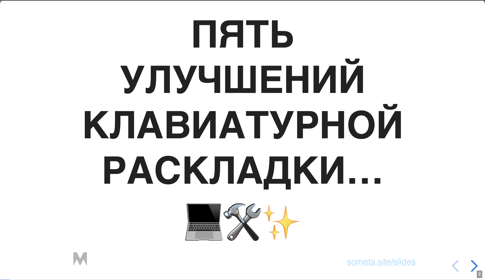
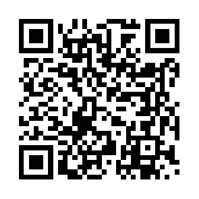
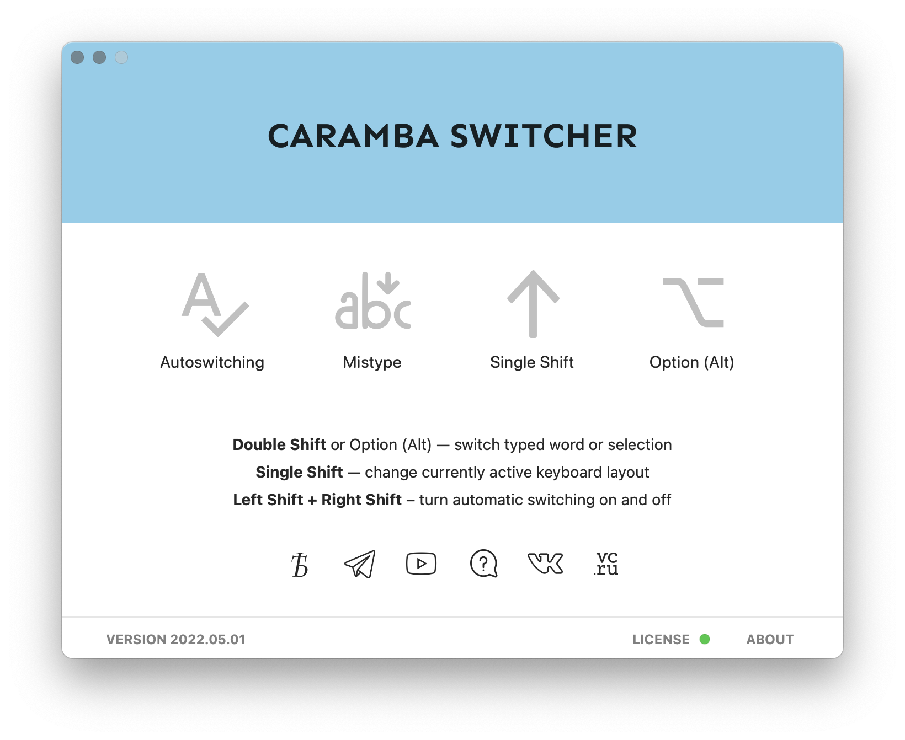
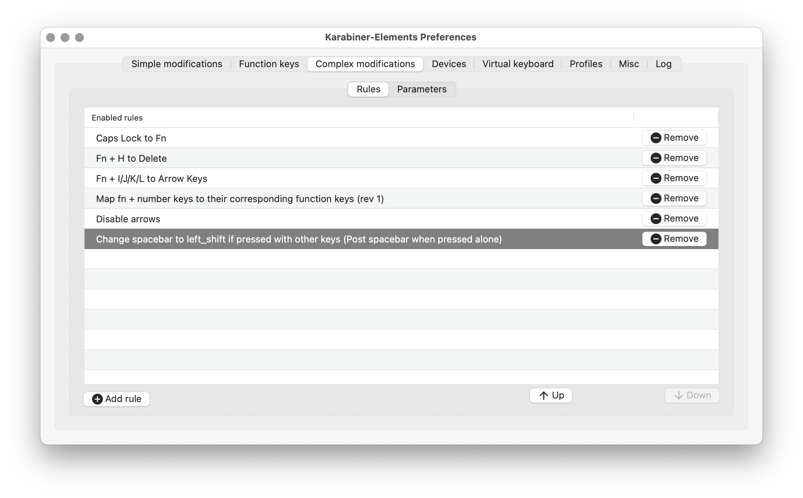
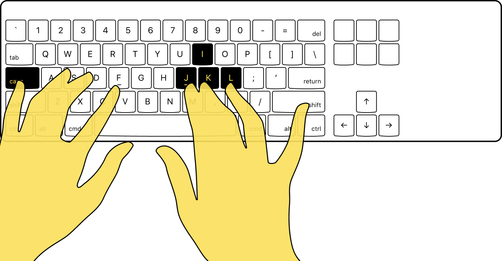
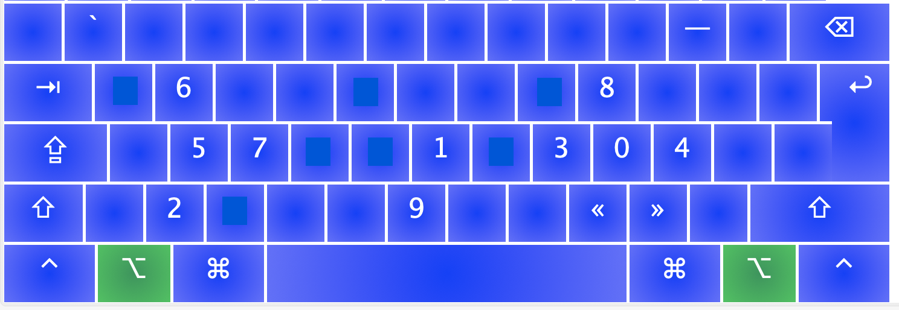
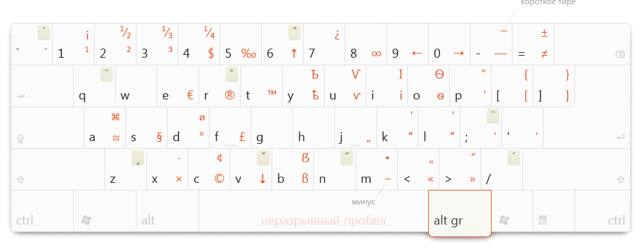

---
presentation:
  theme: white.css
  margin: 0.1
  minScale: 0.2
  maxScale: 1.5
  controls: true
  progress: true
  slideNumber: true
  keyboard: true
  overview: true
  center: false
  touch: true
  shuffle: false
  enableSpeakerNotes: true
  fragments: true
  hideAddressBar: true
  transition: 'slide'
  transitionSpeed: 'default'
  backgroundTransition: 'default'
---

@import "../styles.less"
@import "styles.less"

<!-- slide id="toc" -->
- [Мета](#мета)
  - [Привет](#привет)
- [Улучшения](#улучшения)
  - [Транслитерация](#транслитерация)
  - [Ассоциативная совместимость раскладок](#ассоциативная-совместимость-раскладок)
  - [Переключение верхнего регистра](#переключение-верхнего-регистра)
  - [Стрелочки и Бэкспейс](#стрелочки-и-бэкспейс)
  - [Цифры](#цифры)
- [Прочие улучшения](#прочие-улучшения)
- [Остаюсь на связи](#остаюсь-на-связи)

<!-- slide class="title-slide" data-notes="" -->
# Пять улучшений клавиатурной раскладки...
# 💻🛠✨ 

<!-- slide class="title-slide" data-notes="" --> 
# ...прежде чем вы изобретёте свою
# 😅

<!-- slide class="milestone" data-notes=""-->
## Мета

<!-- slide id="hi" data-notes="Меня зовут Мартын и вы можете меня знать по таким докладам как..."-->
### Привет

<!-- slide class="centered" data-notes="
я перешёл на две собственные клавиатурные раскладки 5 лет назад.  

Но этот доклад будет не о том, как вам пойти по тому же пути или как воспользоваться моим решением. Он также посвящён пути улучшения, но гораздо менее радикальному.
" -->

<!-- slide class="centered" data-notes="" -->
- Про историю QWERTY и раскладку Martynak вы можете послушать [в моём докладе на PiterPy](https://www.youtube.com/watch?v=vXjp7R0G9ws)

<!-- slide data-notes="
И их можно улучшить не пытаясь их переделать с нуля.  

Думаю, что для многих этого может быть достаточно, чтобы дожить до продвинутых технологий перевода речи в текст или переосмысления способов текстового ввода.  

В этом докладе я пойду от обратного:
" -->

> Окей, у нас есть неидеальная, но широко распространённая данность.
    
<!-- slide data-notes="
Почему не 5 как в названии? Ну, потому что два будут дополнительными. 

  Я расставил их в порядке степени полезности по моему субъективному мнению. Итак начнём. 
" -->

Доклад я разбил на 5 частей.

<!-- slide class="shout" data-notes="
Ну, плюс ещё две опциональные главки
" -->

<code>(7)</code>

<!-- slide class="milestone text-background centered" data-background-image="2022-07-16-15-56-30.png"
data-notes="" -->
## Улучшения

<!-- slide class="emoji" data-notes="
Самая очевидная вещь чтобы сократить количество ошибок и раздражения — это научить компьютер исправлять ошибки за нас.
" -->
### Транслитерация
🌐

<!-- slide class="" data-background-image="../assets/no-est-odno-no-meme.jpg" 
data-notes="
Но нет, это тупиковый путь. Автоматическиdе корректоры и транслитераторы не решают проблему на корню, и местами добавляют новых.  

Компьютеры туповаты для этой задачи. Мы сами иногда не знаем что хотим написать, на каком языке и раскладке.
" -->

<!-- slide data-notes="Например мы можем специально писать вот так" -->

<ul>
  <li class="fragment" data-fragment-index="1">V0t t@k VOT 🤡</li>
  <li class="fragment" data-fragment-index="2">sпициальнаи ашипки</li>
  <li class="fragment" data-fragment-index="3">РОФЛ, КЕК, ВТФ</li>
</ul>

<!-- slide class="centered" data-notes="
Вы пишете «Ghbdt, z Vfhnsn», замечаете это, выругиваетесь, нажимаете на горячую клавишу и получаете «Привет, я Мартын».   

Красота. К тому же это можно ещё улучшить с помощью следующего пункта." -->

Ghbdt, z Vfhnsn

<!-- slide class="centered" -->

Привет, я Мартын

<!-- slide data-notes="
Кстати даже если вы печатаете чисто вслепую и всегда смотрите на экран, то это не избавляет вас от раздражения и ошибок.  

Потому что чтобы понять на каком вы сейчас языке, нужно либо специально ошибиться, либо переключить внимание на место, где отображается текущая раскладка.  

В любом случае это прерывает поток мыслей и я за несколько лет так и не приучил себя к этому." -->

Небольшое дэмо
    
<!-- slide data-notes="" -->
#### Какую проблему решаем

<ul>
  <li class="fragment" data-fragment-index="1"> Раздражение от неверной раскладки (самая частая ошибка при печати)</li>
  <li class="fragment" data-fragment-index="2"> Необходимость перепечатывать текст на правильной раскладке</li>
</ul>

<!-- slide data-notes="" -->
#### Какие есть инструменты для этого

- ⭐ [Caramba switcher](https://caramba-switcher.com) (Crossplatform, paid)
- [Punto switcher](https://yandex.ru/soft/punto) (Crossplatform, free)
- [Mahou](https://github.com/BladeMight/Mahou) (Windows, open source, free)
- тысячи их...

<!-- slide data-notes="" -->
#### Как использовать

- Отключяем автопереключения
- Настраиваем горячую клавишу для смены раскладки (я использую двойное нажатие Shift)
- Настройка горячей клавиши для переключения выделенного текста

<!-- slide data-notes="настройки у Карамбы" -->

<!-- slide class="emoji" data-notes="
AKA «Фонетические раскладки»  

Я исхожу и предположения, что почти все вы постоянно используете две раскладки: русскую и английскую.  

И далеко не все из вас умеют печатать одинаково хорошо на обеих, тем более вслепую.  

Вам ведь, по сути, приходится постоянно переключаться из одного способа ввода в другой. Лично, мне переключаться между раскладками приходится очень часто.
" -->
### Ассоциативная совместимость раскладок

🧠

<!-- slide data-notes="
Они как-то соответствуют способу мышления?  

Они упрощают коммуникацию? Они ускоряют ввод?  

Нет, это исторически так сложилось и разумной причины терпеть это нет.
" --> 
> Зачем нам две совершенно разные раскладки?     

<!-- slide class="emoji" data-notes="" -->
- Я предлагаю сократить количество раскладок вдвое

🃏

<!-- slide data-notes="" -->
#### Какую проблему решаем

<li class="fragment" data-fragment-index="1"> 😡 Разное положение знаков пунктуации: <code>. , ‘ ; \ / ? ; [</code> etc…</li>
<li class="fragment" data-fragment-index="2"> Несовместимость языковых раскладок</li>
<li class="fragment" data-fragment-index="3"> Невозможность понять текст на неверной раскладке</li>
<li class="fragment" data-fragment-index="4"> Сложно изучить слепую печать</li>

<!-- slide data-notes="" -->
#### Как решаем проблему

<ol>
  <li class="fragment" data-fragment-index="1">Выбираем основную раскладку. Лучше QWERTY, но можно и взять ЙЦУКЕН</li>
  <li class="fragment" data-fragment-index="2">Для второй раскладки устанавливаем фонетическую версию. ЯШЕРТЫ или JCUKEN</li>
  <li class="fragment" data-fragment-index="3">Если ваша основная раскладка это Dvorak/Colemak/Anymak
    <ul class="fragment" data-fragment-index="4"><li> Это то фонетическую придётся делать самостоятельно с помощью редакторов раскладок или самостоятельно залезая в сорцы.
      <ul class="fragment" data-fragment-index="5"><li> Это отдельная глубокая тема...
      </li></ul>
    </li></ul>
  </li>
</ol>

<!-- slide class="emoji" 
  data-notes="
  Речь о шифтах для переключения регистра.   
  
  Это неудобно даже если научиться правильному чередованию, я проверял.   
  
  Мизинцы ленивы, а нам предлагают использовать их словно это самые ловкие пальцы рук.
" -->
### Переключение верхнего регистра

🎚

<!-- slide data-notes="" -->
> Я предлагаю изменить клавишу переключения регистра.
> 
> С двух на одну, угадайте на какую?

<!-- slide data-background-image="./assets/untitled2.png" data-notes="" -->

<!-- slide class="centered" data-notes="
Можно сделать так чтобы он стал умнее.   

Если зажимаем его, то буквы символы меняют регистр. Буквы становятся большими, а цифры символами (или наоборот).  

Использовать очень легко и можно делать это любым из свободных больших палцев. 
" -->
(Спейс)
    

<!-- slide data-notes="" -->
#### Как это сделать

Проще всего это делается на MacOS
  1. Устанавливаем [Karabiner](https://karabiner-elements.pqrs.org) (MacOS, Open Source, Free)
  2. Добавляем встроенную модификацию поведения пробела

<!-- slide data-notes="- 🤷‍♂️ Для остальных операционок я не знаю инструментов, но уверен, что это возможно." -->

<!-- slide class="emoji" data-notes="" -->
### Стрелочки и Бэкспейс

⬆️⬅️⬇️➡️

<!-- slide data-notes="" -->
- Как вы редактируете текст?
- Как вы перемещаетесь по нему?
- Как часто вы стираете написанное?
- Вы используете Vim или Emacs?

<!-- slide data-notes="Если ваши ответы похожи, то вот что я предлагаю вместо варианта по умолчанию. " -->
- Да
- Легко
- Oчень часто
- Нет

<!-- slide data-notes="" -->
#### Какие проблемы решаем

<li class="fragment" data-fragment-index="1"> Стрелочки сложно найти вслепую, потому что их размещают по разному</li>
<li class="fragment" data-fragment-index="2"> Бэкспейс находится далеко</li>
<li class="fragment" data-fragment-index="3"> Для доступа к стрелочкам и бэкспейсу требуется покинуть «домашний ряд»</li>

<!-- slide data-notes="" -->
#### Как решаем

1. Снова берём Karabiner
2. Добавляем кастомную модификации 
   - Caps Lock to Fn
   - Fn + H to Delete
   - Fn + I/J/K/L to Arrow Keys
- [Подробная статья от Никиты Прокопова как это сделать на любой OS](https://tonsky.me/blog/cursor-keys/)

<!-- slide data-notes="" -->

<!-- slide class="emoji" data-notes="Я долгое время задумывался над идеей, но боялся попробовать.   

Спустя пару лет после внедрения я не понимаю как можно было жить иначе. " -->
### Цифры

 `1337`

<!-- slide data-notes=" Чтож, приготовьтесь стать истинным Цифровиком " -->
> Цифры на четвёртом ряду это больно. Но как тогда иначе? 

<!-- slide data-notes="" -->
#### Какую проблему решаем

<li class="fragment" data-fragment-index="1"> Цифры тяжело печатать вслепую, потому что у клавиатур есть сдвиг рядов
<li class="fragment" data-fragment-index="2"> Цифры далеко от домашнего ряда</li>
<li class="fragment" data-fragment-index="3"> К цифрам привязываются ассоциативно далёкие символы, которые легко перепутать</li>
<li class="fragment" data-fragment-index="4"> 🤯 На четвёртом ряду ещё и два регистра, поэтому печатать символы быстро и легко почти невозможно</li>

<!-- slide data-notes="" -->

<!-- slide data-notes="Не бойтесь он у вас уже есть и на нём уже и так есть символы. Активируется по зажатию alt/option  

Можно даже в два регистра, а можно инвертировать ряд, чтобы цифры оставались *фолбэком*, но только уже в верхнем регистре.
" -->
#### Как решаем проблему

1. Устанавливаем [Ukelele](https://software.sil.org/ukelele) (МacOS, free) или альтернативу для Linux и Windows.
2. Добавляем на клавиатурный слой цифры.
3. Привязываем цифры к ассоциативно близким буквам по логике 1337 (**leetspeak**)
4. Оставляем на четвёртом ряду только символы. 

<!-- slide class="emoji" data-notes="
Чтож, давайте побеседуем про вмешательства в раскладки.  

Ну никак нельзя обойтись без этого, тем более что мы уже залезли в это болото в пункте про цифры.   

Если вы готовы менять раскладки, то вот что можно сделать " -->
### Раскладка
🤷‍♂️

<!-- slide data-notes="" -->
Если не хотите уходить с QWERTY/ЙЦУКЕН, то вот [раскладки Тонского с минимальными, но важными улучшениями](https://github.com/tonsky/Universal-Layout)

<!-- slide data-notes="" -->
А вот «классические» альтернативные раскладки:
- [Дворак](https://dvorak-keyboard.com/)
- [Коулмак](https://colemak.com/)
- [Халмак](https://github.com/MadRabbit/halmak)
- [Мартынак](https://github.com/m0rtyn/martynak)

<!-- slide data-notes="" -->
Своя раскладка

<ol>
<li class="fragment" data-fragment-index="1"> Вооружаетесь редактором раскладок</li>
<li class="fragment" data-fragment-index="2"> Годами экспериментируете</li>
<li class="fragment" data-fragment-index="3"> Делаете несколько докладов о своём опыте</li>
<li class="fragment" data-fragment-index="4"> Проживаете счастливую жизнь</li>
<li class="fragment" data-fragment-index="5"> Умираете во сне
<li class="fragment" data-fragment-index="6"> Попадаете в клавиатурный пантеон</li>
<li class="fragment" data-fragment-index="7"> Веками с ухмылкой наблюдаете как люди мучаются с QWERTY</li>
</ol>

<!-- slide class="milestone emoji" data-notes="" -->
## Прочие улучшения
💤

<!-- slide data-notes="" -->
#### Быстрое переключение языка

Caps Lock, **±**, Alt+Space, Double Shift...
<!-- slide data-notes="" -->
#### Типографские символы
Типографская раскладка Ильи Бирмана

<!-- slide data-notes="" -->
#### Расположение функциональных клавиш `Cmd` & `Opt` & `Ctrl`

<!-- slide data-notes="" -->
#### Печать вслепую 😎

<!-- slide data-notes="" -->
#### Механическая клавиатура 🧰

<!-- slide class="centered" data-notes="" -->
## Остаюсь на связи

- t.me/m0rtyn
- t.me/metabaza
- https://someta.site