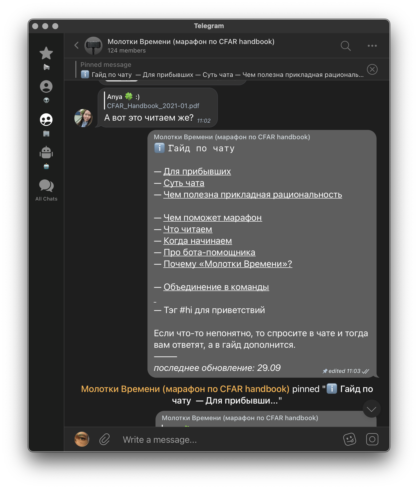
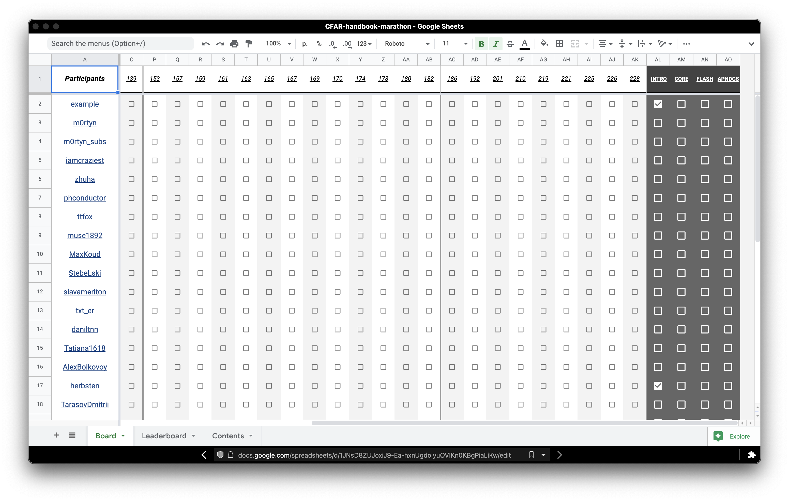
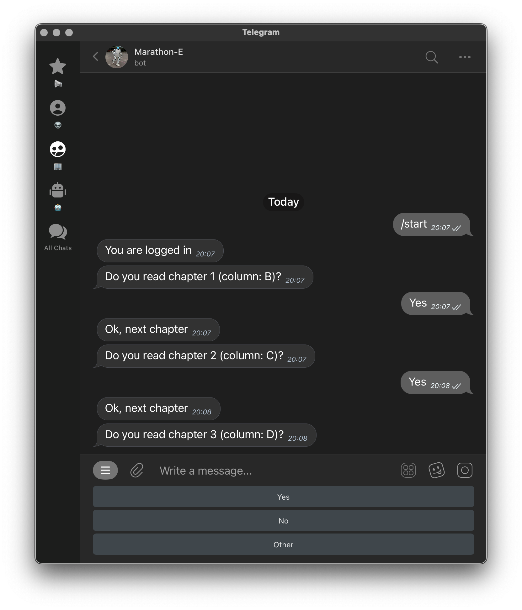

---
presentation:
  theme: night.css
  margin: 0.1
  minScale: 0.2
  maxScale: 1.5
  controls: false
  progress: true
  slideNumber: false
  keyboard: true
  overview: true
  center: false
  touch: true
  shuffle: false
  enableSpeakerNotes: true
  fragments: true
  hideAddressBar: true
  transition: "slide"
  transitionSpeed: "default"
  backgroundTransition: "default"
---

<!-- common styles -->

@import "../styles.less "

<!-- talk styles -->

@import "styles.less"

<!-- slide class="title-slide milestone" data-notes="" -->

# ⚒️⏳ Mолотки Времени

марафон по CFAR handbook

_Спикер: Ма́ртын_

<!-- slide data-notes="
Полагаюсь на помощь людей и самоорганизацию чата
" -->

## <s> Сообщество </s>

<ul>
  <li class="fragment" data-fragment-index="1">
    Чаты с временной активностью
  <li class="fragment" data-fragment-index="2">
    Делаю открытые марафоны по изучению навыков
  </li>
  <li class="fragment" data-fragment-index="3">
    Сделал марафоны  <em>Куб</em>2019, <em>Время Молотков</em>2020 и <em>Нейрана</em>2021
  </li>
</ul>

<!-- slide data-notes="
Как правило это книга по выбранной теме и с хорошей структурой. Марафоны сначала проводил только для себя.  

Я помогаю пройти марафон как можно большей части участников.
" -->

## Цели

- прокачка по прикладной рациональности
- подталкивание к наиболее уважаемому источнику
- подготовка шаблона для марафонов

<!-- slide vertical=true data-notes="
С чатом лучше, потому что появляются дискуссии, полезные уточнения, неоднозначные вопросы и вдохновляющие примеры.  

Для разнообразия точек зрения марафон доступен каждому желающему.
" -->
## Формат

<ul>
  <li class="fragment" data-fragment-index="1">
    Чат
  </li>
  <li class="fragment" data-fragment-index="2">
    Доска
  </li>
  <li class="fragment" data-fragment-index="3">
    Бот
  </li>
</ul>

<!-- slide vertical=true 
data-notes="" -->

<!-- slide vertical=true 
data-notes="
Доской я называю подогнанную под марафон таблицу в G.Sheets.  

С доской лучше, потому что видно путь, прогресс и прогнозы.
" -->

<!-- slide vertical=true 
data-notes="
С ботом лучше, потому что можно делегировать ему рутину марафона и оставаться только в контексте Телеграма.
" -->

<!-- slide 
data-notes="
некоторые команды созваниваются сами на постоянной основе.  

По-умолчанию мы не устраиваем групповых созвонов, однако если кто-то берёт модерацию на себя, то только рады им.
" -->
## Встречи

Мы объединяемся в _мастермаинд-группы_ по 3-5 человек.

<!-- slide 
data-notes="
Можно вписаться в марафон после старта. До финиша «добегает» только часть людей и появление новых участников поддерживает общую мотивацию.
" -->
## Где

**Начало 8 октября**

Темп произвольный. Длительность не менее 3 месяцев.

[Молотки Времени в Телеграме](https://t.me/hammers_of_time)

<!-- slide vertical="true" -->

<!-- slide vertical=true data-notes="..." -->
### 📞 Контакты

- 💬 [Мой Телеграм](https://t.me/m0rtyn)
- 🖊 [Телеграм-канал](https://t.me/metabaza)
- 👤 [Обо мне](https://t.me/martyn_info)

<!-- slide vertical=true data-notes="..." -->
### Ссылки

- Эта презентация
  https://bit.ly/hammers-of-time
- Материалы доклада открыты
  https://github.com/m0rtyn/slides/tree/master/hammers-of-time
