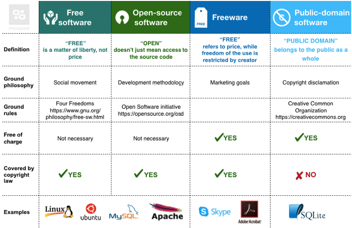
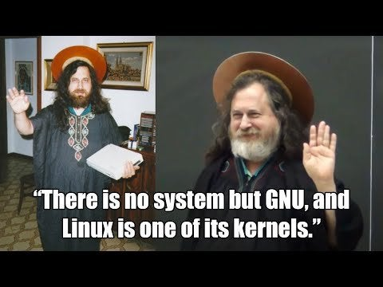
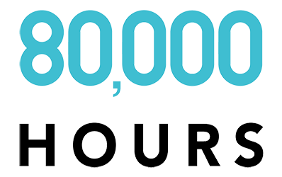
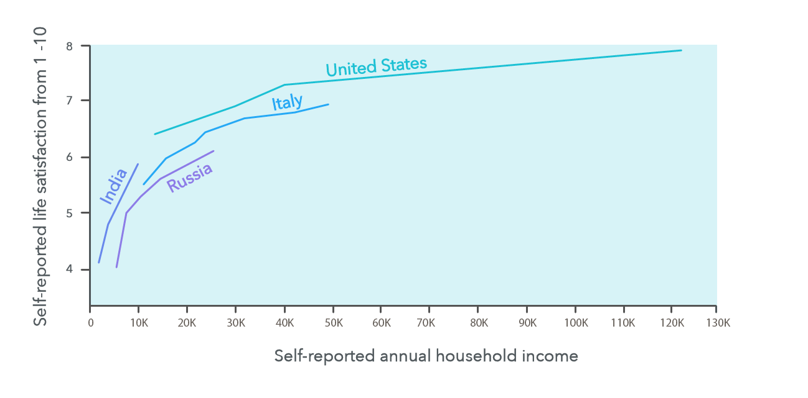
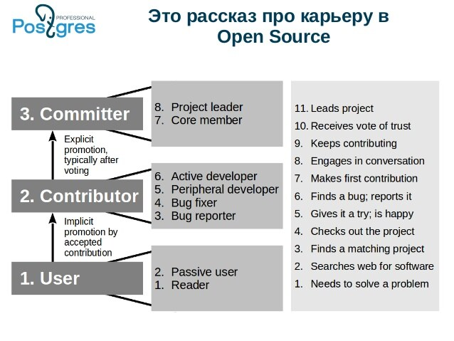
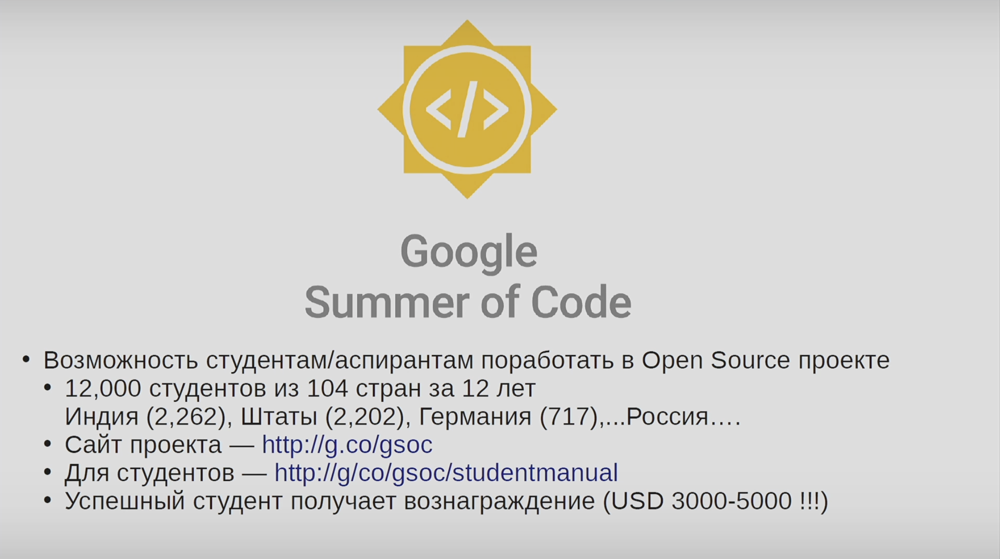
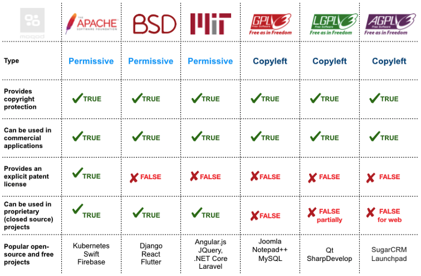

---
presentation:
  theme: white.css
  margin: 0.1
  minScale: 0.2
  maxScale: 1.5
  controls: true
  progress: true
  slideNumber: true
  keyboard: true
  overview: true
  center: false
  touch: true
  shuffle: false
  enableSpeakerNotes: true
  fragments: true
  hideAddressBar: true
  transition: "none"
  transitionSpeed: "default"
  backgroundTransition: "default"
---

<!-- common styles -->

@import "../styles.less "

<!-- talk styles -->

@import "styles.less"

<!-- slide class="title-slide" data-notes="" -->

# 🧑‍💻 → 🧑‍💻🧑‍💻🧑‍💻 Open&nbsp;source

**Почему разработчики делятся**

<!-- slide id="toc" class="light-side" data-notes="
Вот содержание доклада, которое может вам понадобиться если вы будете пересматривать слайды.
</br></br>
Они доступны уже сейчас по адресу, который отображается в правом нижнем углу
" -->

- [Meta](#meta)
  - [😶 Об авторе](#-об-авторе)
  - [Ссылки](#ссылки)
  - [12 Storeez](#12-storeez)
- [Oпенсорс сегодня](#oпенсорс-сегодня)
  - [Звёздочки](#звёздочки)
  - [Free software vs Open source](#free-software-vs-open-source)
  - [Источники](#источники)
  - [Кому нужен опенсорс](#кому-нужен-опенсорс)
- [Откуда взялся опенсорс](#откуда-взялся-опенсорс)
  - [Краткая история опе нсорса (наоборот)](#краткая-история-опе-нсорса-наоборот)
  - [Источники](#источники-1)
- [Об альтруизме](#об-альтруизме)
  - [Источники](#источники-2)
- [Как вкатиться в опенсорс](#как-вкатиться-в-опенсорс)
  - [Карьера в опенсорсe](#карьера-в-опенсорсe)
  - [Оформление проекта](#оформление-проекта)
  - [Источники:](#источники-3)
  - [Коллективные опенсорс-события](#коллективные-опенсорс-события)
  - [Риски для опенсорса](#риски-для-опенсорса)
  - [Источники](#источники-4)
  - [Скандалы опенсорса](#скандалы-опенсорса)
  - [Источники](#источники-5)

<!-- slide class="milestone" data-notes="..."-->

## Meta

`Глава обо всём, что касается доклада, кроме его содержания`

<!-- slide id="hi" data-notes="
Привет, меня завут Мартын и вы можете знать меня по таким докладам как:
<br>- Testosterone driven development
<br>- Не QWERTY единной
<br>- 255 оттенков серого
"-->


<!-- slide vertical=true data-notes="..." -->

### 😶 Об авторе

- 💬 [Телеграм](https://t.me/m0rtyn)
- 👤 [Обо мне](https://someta.site/martyn)
- 🧑‍💻 [Гитхаб](https://github.com/m0rtyn)
- 🖊 [Телеграм-канал](https://t.me/metabaza)
- 🌐 [Блог](https://someta.site)

<!-- slide vertical=true data-notes="..." -->

### Ссылки

- Эта презентация
  **https://someta.site/talks/opensource-as-altruism**
- Материалы доклада открыты
  **https://github.com/m0rtyn/slides/tree/master/opensource-as-altruism**

<!-- slide vertical=true data-notes="..." -->

### 12 Storeez

<!-- slide -->

> Good enough for running in production, but not good enough for Github
> — Netflix engineers

<!-- slide class="milestone" -->

## Oпенсорс сегодня

`Глава, где я нагло «продаю» вам опенсорс`

<!-- slide vertical=true data-notes="
<br>
Отличие Опенсорса в том, что код программы может быть изучен, доработан, использован и просто скопирован.
<br><br>
Речь об исходном коде, который не включает в себя серверные мощности, инфрастуктуру, интеллектуальную собственность или людей стоящих за проектом.
<br><br>
Опенсорс стал основой ИТ. Представьте себе мир без Linux, Python, Firefox, a также без Git, Postgres, Django, Typescript, VSCode, React & Angular & Vue, Etherium, Kubernetes и далее.
<br><br>
В контексте этого доклада я буду говорить об опенсорс-проектах имея в виду репозитории доступные на Github. Исторически так сложилось, я расскажу об этом подробнее чуть позже.
"-->

**Open source** — это код в свободном доступе с возможной модификацией и распространением.

Также это название имеют _методология разработки_, _сообщество_ и _философия_.

<!-- slide vertical=true data-notes="
Опенсорс набрал денежные обороты и всё больше конвертируется в материальные блага.
" -->

<p class="emoji">💰</p>

За опенсорс:

- награждают
- поддерживают
- берут консультации
- нанимают
- присылают футболки\* 👕

<!-- slide vertical=true data-notes="
Опенсорс это методология разработки. А текущий объём опенсорс-проектов покрывает большинство потребностей разработчиков.
" -->

В опенсорсе также есть:

- игры
- списки материалов по многим темам
- книги
- научные работы
<!-- - даже пиво FIXME: dangerous point -->

<!-- slide vertical=true data-notes="ожидаешь половину зала" -->

Кто имеет профиль на Github?
Кто создавал там репозиторий?

<!-- slide class="" vertical=true data-notes="..." -->

### Звёздочки

Звёздочки на Гитхабе ценятся выше лайков на Фейсбуке/ВК поскольку за них вас могут нанять в компанию или пригласить читать доклад. <!-- FIXME: opinionated point -->

<p class="emoji">⭐️</p>
 
<!-- slide vertical=true class="image-over" data-notes="
Я считаю, что мы движемся к более хитрым способам монетизации проектов, которые основанны не на прямой продаже, а на внимании людей.
<br><br>
Опенсорс основa для экономики, где деньги становятся всё более «текучими», добровольными.
<br><br>
Они распространяются легче со всё меньшими комиссиями и меньшим количеством посредников.
" -->


<!-- slide vertical=true data-notes="..." -->

Что даёт участие в опенсорсе

<ul>
    <li class="fragment" data-fragment-index="1"><b>опыт</b> разработки 👨‍✈️</li>
    <li class="fragment" data-fragment-index="3"><b>причастность</b> к сообществу< /li>
    <li class="fragment" data-fragment-index="4"><b>влияние</b> на проекты</li>
    <li class="fragment" data-fragment-index="2"><b>репутацию</b> в сообществе</li>
    <li class="fragment" data-fragment-index="6"><b>независимость</b> местонахождения и родного языка</li>
    <li class="fragment" data-fragment-index="5"><b>карьеру</b> в компании</li>
</ul>

<!-- slide vertical=true data-notes="
Разберёмся в терминах. Большинству известно деление на
" -->

### Free software vs Open source

- _Проприетарное ПО —_ закрытый от изучения софт, который создан для продажи
- _Опенсорс_ — софт, в который можно заглянуть.

<p class="fragment" data-fragment-index="1">Но мы пойдём глубже</p>

<!-- slide vertical=true data-notes="..." -->


<!-- slide vertical=true data-notes="..." -->

#### Open source vs Free software vs Public-domain software vs Freeware

<!-- slide vertical=true data-notes="..." -->


<!-- slide vertical=true data-notes="..." -->

- **Open Source** сосредоточен на доступности исходного кода: возможности изменять его и делиться им
- **Free software** и **Public-domain software** сосредоточены на свободе использовать программу, изменять ее и делиться ею.
- **Freeware**, по своей сути, преследует коммерческие цели и потенциальную монетизацию. Часто встречается как финмодель «Freemium».

<!-- slide vertical=true data-notes="..." -->

### Источники

- [https://blog.usejournal.com/understanding-open-source-and-free-software-licensing-c0fa600106c9](https://blog.usejournal.com/understanding-open-source-and-free-software-licensing-c0fa600106c9)
- [https://www.wikiwand.com/en/Proprietary_software](https://www.wikiwand.com/en/Proprietary_software)

<!-- slide vertical=true data-notes="..." -->

### Кому нужен опенсорс

<ul>
    <li class="fragment" data-fragment-index="4">Разработчикам</li>
    <li class="fragment" data-fragment-index="3">Компаниям</li>
    <li class="fragment" data-fragment-index="2">Государствам</li>
    <li class="fragment" data-fragment-index="1">Науке</li>
</ul>

<!-- slide class="milestone" -->

## Откуда взялся опенсорс

`Глава, где я погружаю вас в исторические тонкости`

<!-- slide vertical=true data-notes="..." -->

Отцом опенсорса считают **Ричарда Столлмана** за его заслуги, почтенный возраст, эпатажные выходки и категоричное мнение о свободе ПО.


<!-- slide vertical=true data-notes="
    Unix это набор модульных узкоспециализированных инструментов для программистов. Которые могут использоваться вместе с ядром операционной системы (в т.ч. входящей в состав Unix).
    <br><br>
    Например содержит:
    <br>
    Файловую систему, управление памятью, управление процессами, компилятор C, ассемблер, сборщик, архиватор, оболочку (шел), документацию
" -->

Проект **GNU** стал популярной открытой разработкой Столлмана. Он был сделан в ответ закрытому **Unix**.

**GNU** расшифровывается как «_GNU is not Unix_»

<!-- slide vertical=true data-notes="" -->


<!-- slide vertical=true data-notes="
если вы слышали о GNU, но не знаете о чём речь, то это норма.
<br><br>
У Столмана дико полыхает от того, что все знают о Линуксе, но не знают о GNU. Он постоянно уточняет, что стоит говорить не просто Линукс, а GNU/Linux, поскольку они в равной степени ответственны за Линукс
" -->

Слова Столмана во время награждения премией Линуса Торвальдса:

> So, very ironic things have happened, but nothing to match this. **Giving the Linus Torvalds Award to the Free Software Foundation is sort of like giving the Han Solo Award to the rebel fleet.**

<!-- slide vertical=true data-notes="..." -->

Столлман является создателем ~~текстового редактора~~ фреймворка для текстовых редакторов **Emacs** и патриархом [церкви Emacs](https://www.wikiwand.com/en/Emacs#Church_of_Emacs) (не спрашивайте)

<!-- slide vertical=true data-notes="..." -->



<!-- slide vertical=true data-notes="..." -->

### Краткая история опе нсорса (наоборот)

<p class="emoji">🏃</p>

<!-- slide vertical=true data-notes="..." -->
<!-- TODO: make list smaller -->

<li class="fragment" data-fragment-index="1"> 
    2021+ 👈 Мы где-то здесь
</li>

<li class="fragment" data-fragment-index="2">
    2018 — <b>Github</b> куплен <b>Microsoft</b>'ом
</li>
<!-- - 2017 — <b>Microsoft</b> стал крупнейшим поставщиком опенсорса -->

<li class="fragment" data-fragment-index="3"> 
    2010+ — Появились <b>Docker</b> и <b>Kubernetes</b>
</li>

<li class="fragment" data-fragment-index="4"> 
    2008+ — Появился <b>Github</b> и его альтернативы, появился <b>Android</b>
</li>

<li class="fragment" data-fragment-index="5"> 
    2005 — Торвальдс сделал <b>Git</b>
</li>

<li class="fragment" data-fragment-index="6"> 
    2002+ — Появление <b>AWS</b> и развитие облачных серверов
</li>
<!-- - Ранние 2000 — скандалы вокруг свободного ПО, появился **Python Software Foundation</b> -->

<!-- slide vertical=true data-notes="
Идею открытого ПО не стоит приписывать одному человеку. Она «витала в воздухе» в ранние годы IT-индустрии.
<br><br>
OSS стал дико развиваться с появлением Github, который предоставил удобный интерфейс и облачный хостинг для Git-репозиториев.
" -->

<!-- TODO: make list smaller -->
<!-- - 1998 — на **Freeware Summit</b> утвердили термин Open source -->

- 1990+ — Торвальдс сделал **Linux**, появился сайт Sourceforge, появился Linux Foundation
- 1989+ — Тим Бернерс-Ли опубликовал спецификацию **World Wide Web**
- 1983+ — Столлман опубликовал **GNU**, манифест свободного ПО и основал Free Software Foundation
- 1970+ — Релиз **Unix**, ПО стало копируемым
- 1960+ — развитие коммерчесского ПО
- 1950+ — начало компьютерной эпохи

<!-- slide vertical=true data-notes="..." -->

### Источники

- Фильм «Революционная ОС»

- [History of free and open-source software | Wikiwand](https://www.wikiwand.com/en/History_of_free_and_open-source_software)
- [Timeline of GitHub | Wikiwand](https://www.wikiwand.com/en/Timeline_of_GitHub)
- [https://spiceprogram.org/history/](https://spiceprogram.org/history/)
- [https://maximilianmichels.com/2021/history-of-open-source/](https://maximilianmichels.com/2021/history-of-open-source/)
- [https://www.oreilly.com/pub/pr/636](https://www.oreilly.com/pub/pr/636)

<!-- slide data-notes="
Я сформировал идею почему кто-то активно пишет в опенсорс, кто-то его только использует, а кто-то стоит в стороне. Дело в потребностях.
" -->

## Об альтруизме

`Глава, где я спекулирую и интерпретирую.`

<!-- slide vertical=true data-notes="" -->


<!-- slide vertical=true data-notes="
По данным исследования «Subjective well-being and income» из книги 80000 часов, людям по достижению определённой суммы дохода дополнительное повышение зарплаты приносит всё меньше и меньше «счастья».
<br><br>
Зато таким людям всё больше приносит удовольствия акт помощи и разделения ресурсов с другими людьми. 
" -->


<!-- slide vertical=true data-notes="..." -->

**На основе этого я понимаю и опенсорс.**

<!-- slide vertical=true data-notes="
Поэтому если у вас есть желание делать опенсорс, но почему-то не выходит, то обратите внимание к себе.
<br><br>
А достаточно ли у вас денег для ощущения безопасности и удовлетворённости? а нашли ли вы свою специальность? а есть ли у вас свободное время на творчество?
" -->

Я убеждён в том, что делятся кодом те, кто:

- удовлетворены в потребностях низшего порядка
- давно и легко пишут код
- принимают и понимают аспекты опенсорса:

<!-- slide vertical=true data-notes="..." -->

- английский язык
- гитхаб
- асинхронные коммуникации
- прозрачность
- добровольность

<!-- slide vertical=true data-notes="..." -->

### Источники

- Книга «800 hours»
- Исследование «Subjective well-being and income: Is there any evidence of satiation?\*»

```Stevenson, Betsey, and Justin Wolfers.
Subjective well-being and income: Is there any evidence of satiation?
No. w18992. National Bureau of Economic Research, 2013 Archived link
```

<!-- slide class='milestone'-->

## Как вкатиться в опенсорс

`Глава, где я наконец делюсь практическими советами.`

<!-- slide vertical=true data-notes="Во-первых, стоит послушать этот доклад — рекурсия" -->

<p class="emoji">😅</p>

<!-- slide vertical=true data-notes="
И опенсорс относится к альтруизму
<br><br>
Если бы в опенсорсе существовали только закрытые репозитории, которые не стремятся привлекать других к совместной разработке, то не получилось бы многих популярных проектов.
<br><br>
Поэтому основой опенсорс-активности является помогать и делиться.
" -->

**Альтруизм** это когда люди делятся ресурсами с окружающими.
<p class="emoji">🎁<p>

<!-- slide vertical=true data-notes="Карьера в опенсорсe" -->

### Карьера в опенсорсe

<p class="emoji">💼</p>

<!-- slide vertical=true data-notes="Карьера в опенсорсe" -->
<!-- TODO: fix size of image -->


<!-- slide vertical=true data-notes="..."
### Чем полезен опенсорс

- Diversity (Разнообразие)
- Доступность к коду
- Passion Economy
- Развитие навыков
- Публичность/прозрачность
- Автономность -->

<!-- slide vertical=true data-notes="..." -->

### Оформление проекта

<p class="emoji">💅</p>

<!-- slide vertical=true data-notes="..." -->

> Делайте опенсорс если вы хотите изменить мир — Андрей Ситник

<!-- slide vertical=true data-notes="..." -->

#### Доступность опенсорс-проектов

Документация — дверь в ваш проект и самый важный элемент

<!-- slide vertical=true data-notes="..." -->

- чёткое описание сути проекта
- подробный алгоритм использования проекта
- опорные элементы
  - изображения
  - сниппеты кода
  - списки
  - заголовки
  - эмодзи

<!-- slide vertical=true data-notes="..." -->


<!-- slide vertical=true data-notes="..." -->


<!-- slide vertical=true data-notes="..." -->


<!-- slide vertical=true data-notes="..." -->

### Источники:

- Доклад: Бартунов Олег, Карьера в Open Source
- Доклад: [Андрей Ситник - Продвижение опенсорс-проектов](https://www.youtube.com/watch?v=SbgqR79nPd0)

<!-- slide vertical=true data-notes="..."
### Как можно помочь сообществу

- ядро
- общение и образование
- экосистема
- документация
- спонсорство -->

<!-- slide vertical=true data-notes="..." -->

### Коллективные опенсорс-события

<!-- slide vertical=true data-notes="..." -->

#### Google summer of code



<!-- slide vertical=true data-notes="..." -->

#### Hacktoberfest


<!-- slide vertical=true data-notes="..."
#### CoMMON -->

<!-- slide vertical=true data-notes="..."
### Лицензии

BSD самая открытая лицензия. Самая распространнённая в опенсорсе — MIT -->

<!-- slide vertical=true data-notes="..."

 -->

<!-- slide vertical=true data-notes="..." -->

### Риски для опенсорса

- hype driven
- Риски безопасности
  - утечки в Эфириуме
- Лицензирование
- Риски качества

<!-- slide vertical=true data-notes="..." -->

### Источники

- [https://www.whitesourcesoftware.com/resources/blog/top-3-open-source-risks-and-how-to-beat-them/](https://www.whitesourcesoftware.com/resources/blog/top-3-open-source-risks-and-how-to-beat-them/)
- [https://www.infocyte.com/blog/2019/06/18/7-risks-posed-by-open-source-software-and-how-to-defend-yourself/](https://www.infocyte.com/blog/2019/06/18/7-risks-posed-by-open-source-software-and-how-to-defend-yourself/)
- [https://www.compact.nl/en/articles/the-risks-of-open-source-software-for-corporate-use/](https://www.compact.nl/en/articles/the-risks-of-open-source-software-for-corporate-use/)

<!-- slide vertical=true data-notes="..."
### Мифы об опенсорсе

- свободное ПО это про Линукс 🤷‍♂️
- коммерческое ПО более успешное финансово чем опенсорсное 🤷‍♂️
- опенсорс это коммунизм 🤷‍♂️
- опенсорс сделает вас популярным 🤷‍♂️ -->

<!-- slide vertical=true data-notes="..." -->

### Скандалы опенсорса

- баны репозиториев и аккаунтов на гитхабе
- лицензия Реакт
- копирайт-троллинг
- этические скандалы приводящие к снятию ключевых персон с руководящих должностей
- Блокчеин-тёрки
- «импортозамещение», когда компании боятся блокировки Гитхаб/Гитлаб/Битбакет

<!-- slide vertical=true data-notes="..." -->

### Источники

- [https://www.synopsys.com/blogs/software-security/top-10-open-source-legal-issues-2019/](https://www.synopsys.com/blogs/software-security/top-10-open-source-legal-issues-2019/)
