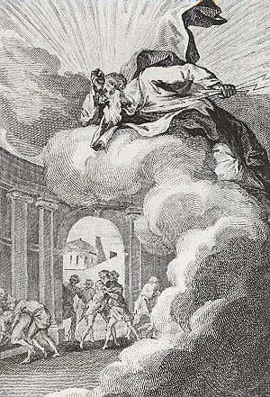
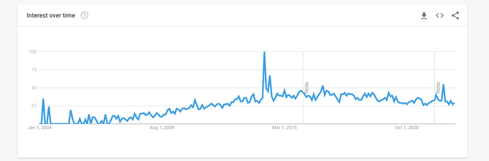

---
presentation:
  theme: moon.css
  margin: 0.1
  minScale: 0.2
  maxScale: 1.5
  controls: true
  progress: true
  slideNumber: true
  keyboard: true
  overview: true
  center: false
  touch: true
  shuffle: false
  enableSpeakerNotes: true
  fragments: true
  hideAddressBar: true
  transition: 'slide'
  transitionSpeed: 'default'
  backgroundTransition: 'default'
---

<!-- common styles -->
@import "../styles.less "
<!-- talk styles -->
@import "styles.less"

<!-- slide data-notes="
Друзья, это выступление я посвятил одному очень популярному слову, которое, как мне кажется, неотделимо от гомофобной русской культуры.  

Это слово мы используем постоянно. Этим словом мы можем называть любимых и врагов. Это слово стало универсальным оскорблением или даже предметом для гордости.  

И это слово... Пидор
" -->
Вступление

<!-- slide class="title-slide milestone" data-notes="
Да, весьма посредственная тема для стэндапа, однако сейчас я вам расскажу о его истинной глубине.  
" -->
# 🎤 Пидор

<!-- slide data-notes="
Итак, давайте недолго покопаемся в истории это удивительного слова. Пидор, Пидорас, Педик и другие производные произошло от слово Педераст. Неудивительно да?  

A знаете ли вы что это значит?  

Изначально это слово не имело негативный коннотаций. В древней греции педерастами звали мужчин, высоко ценящих и даже влюблённых в прекрасных подростков мужского пола.  

С ними вели высокоинтеллектуальные беседы и размышляли о мире, что не могло сравниться с женским обществом. Их почитали и одаривали. Им посвящали стихи и картины.  

Ну и конечно их ебли, и это было во-первых взаимно (почти) и во-вторых приемлемо.  
" -->
## История пидорства

<!-- slide data-notes="
Кстати педерастию ещё называют «греческой любовью». Как это романтично!  

Вот я греческий философ и поэт в древности. И вот какие бы стихи я писал:  

Короче что-то в этом духе

Но не стоит  гнать на греков, ведь формы педерастии были отмечены в древней Японии, в Индии до её колонизации, среди Ацтеков до покорения испанцами, в Китае и Центральной Азии до начала XX века.
" -->

> Я люблю вас по-гречески, мои мальчуганы
> Стоит колом мой пилум, когда вы плескаетесь в ванне...

<!-- slide data-notes="
Педерастия была широко распространена среди греков. Она легко сочеталась с традиционной семьёй. Вот известные педерасты:  
" -->

<!-- // TODO: replace by images -->
<li class="fragment" data-fragment-index="0"> Зевс  </li>
<li class="fragment" data-fragment-index="0"> Геракл </li>
<li class="fragment" data-fragment-index="0"> Ахилл </li>
<li class="fragment" data-fragment-index="0"> Орфей </li>

<!-- slide data-notes="
Но это далеко не полный список, к тому же это всё мифические персонажи. Примеры настящих педерастов вот:  

Ну понятно, что Владимир не из того времени, и вообще выдуман, но мне некуда было его вставить, а он мне симпатичен.
" -->

<!-- // TODO: replace by images and expand list-->
<li class="fragment" data-fragment-index="0">Платон</li>
<li class="fragment" data-fragment-index="0">Сократ</li>
<li class="fragment" data-fragment-index="0">Владимир Харконен</li>

<!-- slide data-notes="
Так что мы с вами, в каком-то смысле, дети педерастов. Хоть педерастия и была своеобразной контрацепцией.  

Long story short. К педерастии всё строже со временем относились, её могли осуждать в Риме, но запреты были единичными.  

Полный запрет пришёл с монотеизмом. В христианстве, а затем и в Исламе педерастия, как и иные нетрадиционные сексуальные отношения были осуждены.  

Ну вы наверное знаете все эти странные эфемизмы: содомиты, малакии, мужеложники, мужеблуды, и даже bougre (что является латинским обозначением болгар)  

Христианство такое: «всё бля, я натерпелось всего этого».

Видимо эта привелегия осталась лишь у самых приближённых к богу чинов.
" -->

<!-- //todo: meme with jason statham «я вам запрещаю ебстись с детьми» -->

<!-- slide data-notes="
Теперь, когда мы узнали больше, интересно узнать как педерастия стала означать гомосексуализм и как россия вкусило это слово с проглотом.

Примерно с XVI века педерастами в Европе стали называть вообще всех мужчин, практикующих однополые анальные сексуальные контакты.

Само собой это закрепилось и в России, но уже в искажённом виде: «педер», «педерас», «педик», «педрила», «пидор», «пидорас»

Однако путешественников шокировало широкое и открытое распространение педерастии и гомосексуальности на Московской Руси (14—16 вв.). Которые там, в отличие от Западной Европы, не преследовались по закону.
" -->

Однако вы и сами знаете, что сейчас Пидор это универсальное оскорбления всех неправых и плохих. А для ещё большего осуждения мы используем слово Пидорас.

Меня удивляет насколько это слово стало обыденным. Вот вы зовёте пидорами близких? Я да, почти каждый день зову Сашу и Дофамина пидорами.

Особенно дофамина. Он даже преобрёл клички — педрон.

А Саша я читаю стих: «Лублю тебя, педра творение...»

А в детстве я знал странного паренька с дефектом речи, он говорил как-то так «чо смотлыш пиджел».

<!-- slide -->
Чтож, теперь мы знаем как много любви и ненависти в этом слове.

А вот что я нашёл касательно использования этого слова в статистике запросов к гуглу...

<!-- slide data-notes="
видимо его популярность напрямую связана с потрясениями в России"-->
*картинка с графиком*

<!-- slide data-notes="a вот какие вариации слова пидор мы имеем" -->

#### Вариации

ахтунг
барсук
валет
василёк
вафел
галя
гамадрил
гамазей
гей
глиномес
говносек
голубой
гомик
додик
дуплан
дырявый
жополаз
заднеприводный
заднепроходец
манька
мужеложец
мужиковед
округлённый
педераст
педермот
педик
педрила
петушок
пидорюга
половой демократ
рудокоп
сидор
содомит
солидол иванович
трубочист
уранист
яойщик

#### дальше

<!-- slide -->

- одесские анекдоты
    
    **Правда ли, что великий композитор Чайковский был пидором?
    Правда. Но мы его любим не только за это.**
    
    Вы знаете, Сёма, а Рабинович-то пи#@р!
    Шо, деньги не отдает?
    Да нет, я в хорошем смысле.

<!-- slide -->

> На самом деле весь этот мир — Пидор