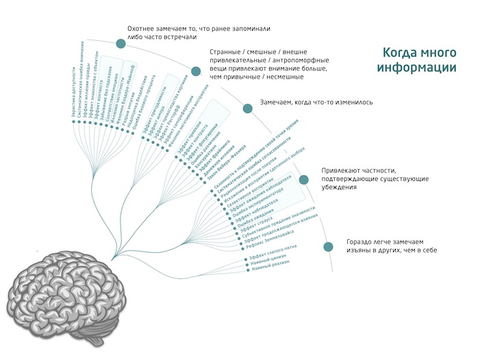
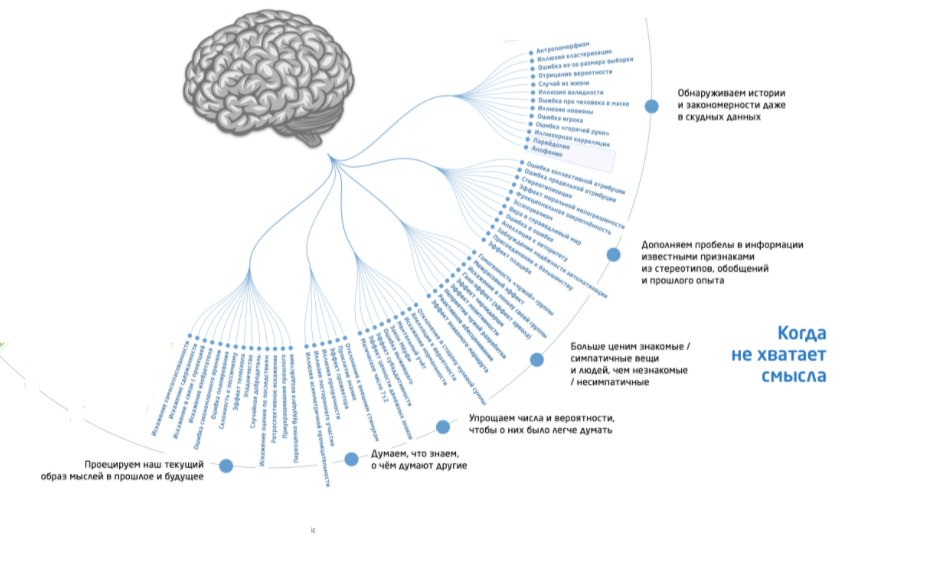
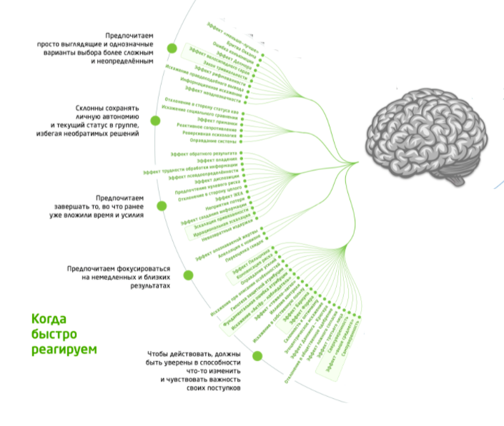
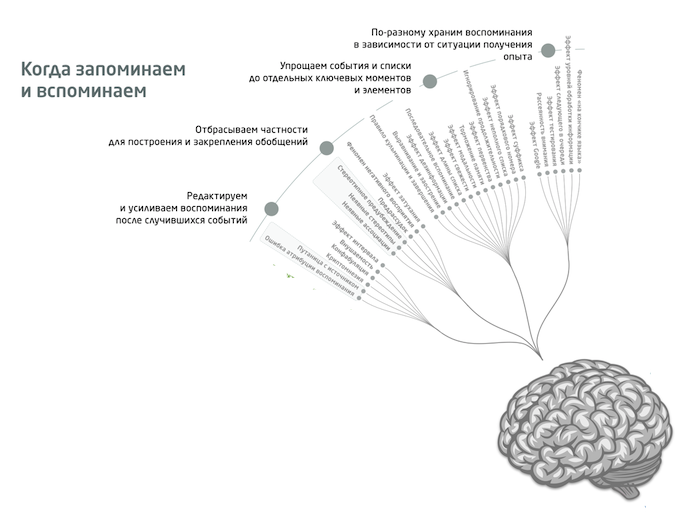

---
presentation:
  theme: white.css
  margin: 0.1
  minScale: 0.2
  maxScale: 1.5
  controls: true
  progress: true
  slideNumber: true
  keyboard: true
  overview: true
  center: false
  touch: true
  shuffle: false
  enableSpeakerNotes: true
  fragments: true
  hideAddressBar: true
  transition: 'slide'
  transitionSpeed: 'default'
  backgroundTransition: 'default'
---

<!-- common styles -->

@import "../styles.less "

<!-- talk styles -->

@import "styles.less"

<!-- slide
class="title-slide milestone"
data-background-image="./assets/12storeez-backgrounds/john-towner-X48hkTT1qQc-unsplash.jpg"
data-notes="" -->

# РАЦИОНАЛЬНОСТЬ: Искусство меньше ошибаться

<!-- slide vertical="true" class="" data-notes="" -->

> Я не могу ни подтвердить, ни опровергнуть, что обладаю магическим артефактом невероятной силы.
>
> — «Гарри Поттер и методы рационального мышления»

<!-- slide
class="milestone"
data-background-image="./assets/12storeez-backgrounds/amy-humphries-eZaQ0A8fTiQ-unsplash.jpg"
data-notes="
Предлагаю перед погружением в тему посмотреть на этот доклад со стороны.
"-->

## Мета

<!-- slide
vertical=true
id="toc"
data-notes="
Вот содержание доклада, которое может вам понадобиться если вы будете пересматривать слайды.
  
Они доступны уже сейчас по адресу, который отображается в правом нижнем углу
" -->

- [Мета](#/1)
- [Проблема ошибок](#/2)
- [Как появилось сообщество «Less Wrong»](#/3)
- [Что есть рациональность](#/4)
- [Что можно использовать](#/5)
- [Хлебные крошки](#/6)

<!-- slide
vertical=true
-->

### Один доклад — одна мысль

**Рациональность** — это потенциально универсальная методология для решения внешних проблем, которая сейчас развивается на наших глазах. [К описанию базовых техник ➡](#hammers)
[К описанию теории ➡](#maps)

<!-- slide
vertical="true"
id="hi"
class="emoji"
data-notes="
Привет, меня завут Мартын и вы можете знать меня по таким докладам как:
 - Testosterone driven development
 - Open Source: Почему разработчики делятся
 - Не QWERTY единной
 - 255 оттенков серого
"-->

👋

<!-- slide vertical=true data-notes="..." -->

### Moи ссылки

- 👤 [О Мартыне](https://someta.site/martyn): https://someta.site/martyn
- 💬 [Личный Телеграм](https://t.me/m0rtyn): https://t.me/m0rtyn
- 🖊 [Телеграм-канал](https://t.me/metabaza): https://t.me/metabaza
  <!-- - 🧑‍💻 [Гитхаб](https://github.com/m0rtyn) -->
  <!-- - 🌐 [Блог](https://someta.site) -->

<!-- slide vertical=true data-notes="
Тема рационального мышления увлекла меня в 2016 году, когда я познакомился с книгой «ГПМРМ».

  
Меня вдохновила идея об изучении моделей, которые лучше описывают окружающий мир и помогают легче справляться с проблемами. Особенно меня поразило, что уже известно много общих для людей ошибок мышления.

  
Тогда я вступил в чат, где находилось несколько сотен рационалистов из России. Начал с ними общаться и изучать рекомендуемые материалы. С тех пор я понял, что это было полезным увлечением.

  
Хочу поделиться с вами докладом чтобы и вы могли заинтересоваться.
" -->

### Почему рациональность

<!-- slide vertical=true data-notes="
Всё просто — я увидел среди ценностей 12 Сториз рациональность и решил объеденить приятное с полезным. И так совпало, что я первый, кто предложил рассказать об этом.

  
Кажется, это простейший способ найти единомышленников в компании, а также распространить ценности рациональности.
" -->

### Почему я

<!-- <!-- slide vertical=true data-notes="
Я люблю выступать и сделал более десяти докладов на разные темы. Для меня это наиболее ёмкий и удобный способ поделиться информацией. Хочется чтобы слушатели при желании могли сами продолжить свой путь по теме.
"

### Почему доклад -->

<!--
<!-- slide class="brand-12storeez" vertical=true data-notes="..."
### 12 Storeez -->

<!-- slide
vertical="true"
class="emoji"
data-notes="
5 min

Поскольку у ещё не накопились вопросы, то я расскажу вам про курицу из анонса. Речь идёт о книге ГПМРМ и споре о том, что произошло во время одного из первых разговоров Гарри и Дамблдора, когда у них на глазах сгорел феникс. Из-за того, что Дамблдор это персонаж, который намеренно ведёт себя непредсказуемо, то до конца нонятно действительно ли это был феникс или это была постановка с курицей.
" -->
⏱

<!-- slide
class="milestone"
data-background-image="./assets/12storeez-backgrounds/andy-hyd-tAzAqh0419g-unsplash.jpg"
data-notes="..." -->

## Проблема ошибок

<!-- slide vertical=true data-notes="

" -->

### Начнём с примеров

<!-- slide  vertical=true data-notes="
Вы покупали абонемент в спортзал или на курс, заранее оплатив сумму на длинный период? А случалось ли у вас чувство, что нужно продолжать ходить на него даже если на практике вам было тяжело посещать занятия? Или обратная ситуация, когда бесплатные занятия вы не посещали, а за деньги — да?
" -->

#### Пример с абонементом

<!-- slide vertical=true data-notes="
Пытались ли завести новую привычку? А если пропускали один-два дня то падала ли мотивация?
" -->

#### Пример с привычкой

<!-- slide vertical=true data-notes="
Делали ли вы прогноз о длительности проекта, который оказывался далёк от реальности в несколько раз?
" -->

#### Пример с оценкой

<!-- slide vertical=true data-notes="
Я привёл лишь малую часть примеров с когнитивными искажениями. Хочу рассказать вам о нашей общей проблеме — мы постоянно ошибаемся и делаем это одинаково.
" -->

### Когнитивные искажения

<!-- slide vertical=true  data-notes="
Мы совершаем когнитивные искажения постоянно. Их известно много и их тяжело избегать. Не совершать их невозможно.

  
пример ошибки выжившего:
3 человека ушли в лес, вернулся один. Вы спросите его, как он выжил — и он расскажет, как ел кору, жевал траву, пил из ручья и всё такое прочее. Так вот, в концепции «ошибки выжившего» всё это не имеет значения. Имеет значение, что тот не делал — не дразнил медведя, не лез в осиное гнездо, не ел подозрительные грибы и растения.
" -->

#### Что это

_Систематические ошибки в мышлении, которые происходят у большинства людей_

<!-- slide vertical=true 
data-notes="как вы думаете искажение из какой группы вы испытываете глядя на эту картинку?"
-->

<!-- slide vertical=true -->

<!-- slide vertical=true -->

<!-- slide vertical=true -->

 

<!-- slide vertical=true -->

<!-- slide vertical=true -->

#### Группы когнитивных искажений

- Когда много информации
- Когда не хватает смысла\*
- Когда быстро реагируем
- Когда запоминаем и вспоминаем

<!-- slide vertical=true data-notes="
Искажения могут делать плохо или хорошо, однако они будут происходить всегда. Поэтому лучше относиться к ним нейтрально, как к неизбежному факту.

  
Например, у меня в руках Х или за моим окном темно/светло. Факты, что я рассказываю доклад и вы слушаете меня. Я забыл рассказать о важной детали в плане доклада — это уже и искажение, но тоже факт.

  
Нейтральное восприятие искажений помогает быстрее принять их у себя и у окружающий. Затем уже можно начать использовать их в свою пользу.

  
чем более интеллектуальная работа у человека и чем в меньшей степени он выживает в моменте, тем в большей степени ему мешают когнитивные искажения
" -->

#### Это плохо?

  Это данность

  🤷‍♂️

<!-- slide
vertical="true"
class="emoji"
data-notes="
15 min
" -->
⏱

<!-- slide
class="milestone"
data-background-image="./assets/12storeez-backgrounds/alvaro-matzumura-ZAk2WOxbLD4-unsplash.jpg"
data-notes="..." -->

## Как появилось сообщество «Less Wrong»

<!-- slide class="long-list" vertical=true data-notes="
Не смотря на то, что рациональность это давно существующее понятее её современную историю можно рассказать довольно быстро. Я назову лишь три ключевых имени: Амос Тверски, Дэниэль Канеман и Элиезер Юдковский
"-->

### Краткая история рациональности

<!-- https://www.youtube.com/watch?v=opW4Tq-PLZ4 -->
<!-- https://www.youtube.com/watch?v=JIqO3V3drKw -->

<ul>
  <!-- <li class="fragment" data-fragment-index="1">Рациональная революция за счёт повышенного интереса к статистики и вероятностям — период Второй Мировой войны</li> -->
  <!-- <li class="fragment" data-fragment-index="1">Аксиомы рациональности от Джона Фон Неймана и Оскара Моргенштерна</li> -->
  <!-- <li class="fragment" data-fragment-index="1">Мильтон Фридман и теория «As if»</li> -->
  <li class="fragment" data-fragment-index="1">🔬 Понятие когнитивного искажения — 1972</li>
  <!-- <li class="fragment" data-fragment-index="1">Гарри Марковиц — тоже нобелевка</li> -->
  <li class="fragment" data-fragment-index="2">🏆 2002 — Нобелевская премия по экономике для Канемана</li>
  <li class="fragment" data-fragment-index="3">📝 2006 — Overcoming Biases</li>
    <!-- by artificial intelligence theorist Eliezer Yudkowsky and economist Robin Hanson -->
  <li class="fragment" data-fragment-index="4">📝 2009 — LessWrong</li>
    <!-- Yudkowsky's posts were used as the seed material to create the community blog LessWrong -->
  <li class="fragment" data-fragment-index="5">📘 Книга «Думай медленно... решай быстро» — 2011</li>  
  <li class="fragment" data-fragment-index="6">🚩 Центр прикладной рациональности (CFAR) — 2012</li>
  <li class="fragment" data-fragment-index="7">📗 Книга «Рациональность: from Ai to Zombies — 2015</li>
  <li class="fragment" data-fragment-index="7">📕 Книга «Гарри Поттер и Методы Рационального Мышления — 2015</li>
  <li class="fragment" data-fragment-index="7">🚩 Центр рациональности «Кочерга»</li>
  <li class="fragment" data-fragment-index="8">😎 Этот доклад — сейчас</li>
  <!-- <li class="fragment" data-fragment-index="1">Slate Star Codex — In 2013</li> -->
    <!-- a significant portion of the rationalist community shifted focus to Scott Alexander's blog -->
  <!-- <li class="fragment" data-fragment-index="1">Book The AI Does Not Hate You — 2019</li> -->
    <!-- LessWrong and its surrounding movement are the subjects of the book written by science correspondent Tom Chivers -->
</ul>

<!-- slide
vertical="true"
class="emoji"
data-notes="
25 min
" -->
⏱

<!-- slide
id="maps"
class="milestone"
data-background-image="./assets/12storeez-backgrounds/krista-mangulsone-RnR12I78SFo-unsplash.jpg"
data-notes="
В анонсе я говорил, что определения рациональности объединяет общий принцип — малое количество ошибок. А развёрнуто мы можем определить её как успешное достижение целей как за счёт избегания ошибок, так и с помощью сочетания полезных действий.
" -->

## Что есть рациональность

<!-- slide  vertical=true data-notes="
Но для начала давайте посмотрим где чаще всего применяется рациональность. 
Экзистенциальные риски 
Эффективный альтруизм 
Наука 
Стартапы 
IT-проекты

  

Это не исчерпывающий список. Общая черта этих областей в степени неизвестности и недостатке 
отчётливой и моментальной обратной связи.

  
В противоположность этому рациональность скорее вредна там, где и так давно существуют наиболее эффективные методы и правила. Это области, в которых меньше неизвестного и проще отличить причину от следствия. Это области, которые давно доказали свою эффективность и более консервативны. Это юриспруденция, операционка, финансы.
"-->

### Где применяется рациональность

<!-- <ul>
  <li class="fragment" data-fragment-index="1">Экзистенциальные риски</li>
  <li class="fragment" data-fragment-index="2">Эффективный альтруизм</li>
  <li class="fragment" data-fragment-index="3">Наука</li>
  <li class="fragment" data-fragment-index="4">Стартапы</li>
  <li class="fragment" data-fragment-index="5">IT-проекты</li>
</ul> -->

<!-- slide  vertical=true data-notes="
А средством достижения нам помогает две фундаментальные части рациональности
"-->

### Из чего состоит рациональность

<ul>
  <li class="fragment" data-fragment-index="1">
    Более точное представление о мире
    <ul>
      <li class="fragment" data-fragment-index="2">Эпистемичность</li>
    </ul>
  </li>

  <li class="fragment" data-fragment-index="1">
    Более эффективное принятие решений
    <ul>
      <li class="fragment" data-fragment-index="3">Инструментальность</li>
    </ul>
  </li>
</ul>

<!-- slide vertical=true data-notes="
Метафора о карте и территории — «Карта не есть территория» (впервые сформулированная учёным Альфредом Коржибским) — является важной частью философии LessWrong.

  
почему как вы думаете Карта не равна Территории?

  
Под «картой» понимается представление человека о мире, под «территорией» — сам мир (реальность).
"-->

##### Карта и территория

<!-- slide
vertical="true"
class="emoji"
data-notes="
25 min
" -->
⏱

<!-- slide
class="milestone"
data-background-image="./assets/12storeez-backgrounds/evie-s-uF2j60rp6Rs-unsplash.jpg"
data-notes="..." -->

## Что можно использовать

<!-- slide vertical=true data-notes="
Скорее всего какая-то часть техник вам известна и вы их практикуете. Возможно вы о них узнали из других областей и называете другими именами.

Поэтому каждого из вас можно уже назвать рационалистом, однако лично мне пришлось отказаться от некоторых интуитивных и привычных способов решения задач.

Дело в том, что я их делал «грязно» смешивая в одно, не ставя границы или упуская важные детали. Это можно сравнить с самоучками и теми, кто получил образование. Сложно сказать что из них и на каком этапе эффективнее, но второй подход ориентирован на долгосрочную эффективность, а первый на эффективность в моменте. Считаю, что лучшим будет тот, кто объединил подходы.
" -->

### Вы уже рационалисты

<!-- slide
id="hammers"
vertical=true
data-notes="
Прикладная рациональность это техники избавляющие от когнитивных искажений, которые мешают нам действовать или уводят действия от целей.

Кто-то назовёт это продуктивностью, но цель этих техник не в этом. Их цель — помочь в избежании известных и общих проблем в процессе решения уникальных проблем.

Возможно некоторые техники могут не сработать у вас
Нет гаратии что всё начнёт работать сразу
Стоит начать пробовать и не расстраиваться если оно не получилось или не принесло пользу.
" -->

### Прикладная рациональность

<!-- slide 
vertical="true"
class="emoji"
data-notes="
Помодоро, Третье правило Паркинсона, таймблокинг

  
Суть Йода-таймеров в установлении предохранителя на расходные для ресурса мышления процессы. Если вы увлечётесь анализом факторов, то не сможете перейти к выбору если потратите на него слишком много сил (см. паралич анализа). Йода-таймеры стоит использовать в связке с почти всеми рациональными техниками. Иногда ещё он является гарантом, что необходимое время конечно и не принесёт огромного неудобства, но скорее всего это говорит о проблеме в   процессе.
" -->

#### Йода-таймеры

⏲

<!-- slide
vertical=true
class="emoji"
data-notes="
багхант это одна из самых фундаментальных очевидных техник, которую кто-то назовёт давергенцией или бреинштормом или выгрузкой в инбокс, однако её стоит использовать с осторожностью — по таймеру и гранулярно от других шагов

багхант это одна из самых фундаментальных очевидных техник, которую кто-то назовёт давергенцией или бреинштормом или выгрузкой в инбокс, однако её стоит использовать с осторожностью — по таймеру и гранулярно от других шагов

багхант можно составлять даже несколько раз в день
" -->

#### Охота за багами

🏹

<!-- slide vertical=true
class="emoji"
data-notes="
птд в первую очередь стоит направлять на создание автоматических цепочек самих же прикладных практик
" -->

#### Триггер-Действие

🔫

<!-- slide
class="emoji"
vertical=true
data-notes="
аналогия факторизации целей — техника 5 почему
"
-->

#### Факторизация целей и избеганий

🔪

<!-- slide
vertical=true
data-notes="
Напоследок я хотел дать ещё одну полезную технику, которая называется «Разбор внутреннего конфликта». С её помощью можно находить согласие в диалоге внутренних голосов. Однако я решил, что полезне будет выделить из этого наиболее важную часть — умение различать и выслушивать внутренние голоса, особенно самые тихие из них.

Для тренировки необходима тишина и покой потому что эфир нашего сознания часто заполнен внешними стимулами и мы заняты реагированием на них. Я сам не особо силён в интроспекции, мне тяжело распозновать сигналы от тела и различать эмоции. Тем не менее, способность совершать остановку и прислушиваться к себе — открывает доступ к мощным техникам: фокусирование, разбор внутреннего конфликта, отделение от эмции, избавление от реакций, растворение проблем.

Как достичь покоя?
- Прогулка в одиночку
- Душ/Ванна
- Автоматическая деятельность (бег/мытьё посуды)
- Писательство/Ведение дневника
- Медитация
"
-->

#### Покой

🧘

<!-- slide
vertical=true
data-notes="
сила рациональных техник в возможности составлять из них 
цепочки под потребности

рациональные техники подобны чистым функциям без сайд эффектов и состояния
    
их можно комбинировать в цепочки

  
рациональные техники требует переучиться процессу решения задач, потому что каждый из нас привык к собственному интуитивному подходу состоящему из множества условий.
Возможно даже переход на рациональный процесс с начала будет казаться шагом назад и внесёт одно только неудобство, но это шаг назад ради нескольких шагов вперёд
" -->

### Композиция техник

🎼

<!-- slide
vertical="true"
class="emoji"
data-notes="
30 min
" -->
⏱

<!-- slide 
class="milestone"
data-background-image="./assets/12storeez-backgrounds/pablo-merchan-montes-SCbq6uKCyMY-unsplash.jpg"
-->

## Хлебные крошки

<!-- slide  vertical=true -->

### Список сопутствующих тем

- Ненасильственное общение
- Уличная эпистемология
- Эффективный альтруизм
- Трансгуманизм
- Когнитивная психология
<!-- - Когнитивно-поведенческая терапия -->

<!-- slide  vertical=true -->

### Список ссылок

<!-- slide  vertical=true -->

### Список книг

- https://lesswrong.ru/wiki/%D0%A1%D0%BF%D0%B8%D1%81%D0%BE%D0%BA_%D0%BB%D0%B8%D1%82%D0%B5%D1%80%D0%B0%D1%82%D1%83%D1%80%D1%8B_%D0%BE%D1%82_CFAR

<!-- slide vertical=true data-notes="
Иногда вы стали соглашаться с ними автоматически, если все были одного мнения. Спустя время вы заметили как стали говорить как они, переняли их привычки и убеждения.
" -->

### Положительные примеры искажений

- Вы попали в новый коллектив из вдохновляющих и талантливых людей.
- Вы положили форму и кросовки на выходе из квартиры.
- Вы говорите себе, что не собираетесь делать сложную задачу целиком, а только продвинетесь в ней на один шаг.

<!-- slide  vertical=true -->

### Две системы мышления

- Быстрое мышление
- Медленное мышление

<!-- slide  vertical=true data-notes="
Мы говорим, что работает первая система, когда человек что-то осознаёт автоматически, практически без каких-либо усилий: например, понимает смысл написанного на хорошо знакомом языке, узнаёт известного ему человека в лицо, когда в памяти всплывает что-то очень хорошо заученное, и так далее.

  
первая система работает на эвристиках мышления. Но как определяются Эвристики мышления?
"-->

#### Система 1

<!-- slide  vertical=true data-notes="
Мы говорим, что работает вторая система, когда человек может осознать собственный мыслительный процесс, может понять, что он предпринимает умственные усилия.

  
Хотя Система 2 и считает себя главным действующим лицом, в действительности герой этой книги — автоматически реагирующая Система 1.

  
система 2 тем эффективнее чем более эффективные алгоритмы мы предлагаем ей на исполнение

  
система 2 может влиять на систему 1, но с ограниченной эффективностью
"-->

#### Система 2

<!-- slide vertical=true -->

### Мифы о рациональности

<ul>
  <li class="fragment" data-fragment-index="1">Рациональность это интеллект</li>
  <li class="fragment" data-fragment-index="2">Рациональность только для прогаммистов</li>
  <li class="fragment" data-fragment-index="3">Рационалисты безэмоциональны</li>
  <li class="fragment" data-fragment-index="4">Рационалисты эгоистичны</li>
  <li class="fragment" data-fragment-index="5">Рационалисты нигиристы</li>
  <li class="fragment" data-fragment-index="6">Рационалисты только теоретизируют</li>
  <li class="fragment" data-fragment-index="7">Тусовка академична и закрыта</li>
  <li class="fragment" data-fragment-index="8">Это очень сложно</li>
</ul>