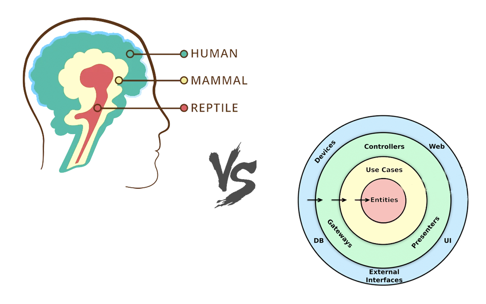
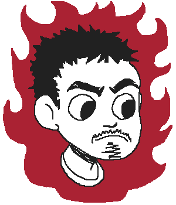
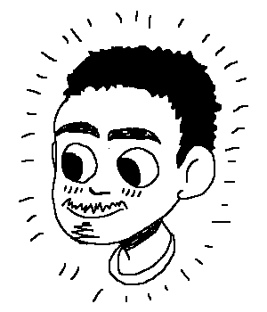

---
presentation:
  theme: blood.css
  margin: 0.1
  minScale: 0.2
  maxScale: 1.5
  controls: false
  progress: true
  slideNumber: true
  keyboard: true
  overview: true
  center: false
  touch: true
  shuffle: false
  enableSpeakerNotes: true
  fragments: true
  hideAddressBar: true
  transition: 'slide'
  transitionSpeed: 'default'
  backgroundTransition: 'default'
---

@import "../styles.less"
@import "styles.less"

<!-- slide class="title-slide" data-notes="Кстати насчёт моего наставника. Его зовут Руслан Жубанищев, привет. 

 Полагаю вы уже знаете как называется этот доклад" -->
# 💢🧔🏻💢 Testosterone Driven Development

<!-- slide id="toc" class="light-side" data-notes="Вот содержание доклада, которое может вам понадобиться если вы будете пересматривать слайды.
  
Они доступны уже сейчас по адресу, который отображается в правом нижнем углу" -->

- [`> Input`](#-input)
  - [Дисклеймер!](#дисклеймер)
  - [Про мозг и заблуждения](#про-мозг-и-заблуждения)
  - [Про второго докладчика](#про-второго-докладчика)
- [НЕ стоит влезать в эту тему](#не-стоит-влезать-в-эту-тему)
  - [НЕ пускайте женщин в программирование](#не-пускайте-женщин-в-программирование)
  - [НЕ делайте ревью кода](#не-делайте-ревью-кода)
  - [НЕ пишите тесты](#не-пишите-тесты)
  - [НЕ используйте статическую типизацию](#не-используйте-статическую-типизацию)
  - [НЕ делайте рефакторинг кода](#не-делайте-рефакторинг-кода)
  - [НЕ документируйте код](#не-документируйте-код)
  - [НЕ полагайтесь на стайлгайд](#не-полагайтесь-на-стайлгайд)
  - [НЕ думайте о <a href="https://ru.hexlet.io/courses/introduction_to_programming/lessons/while/theory_unit#deklarativnoe-vs-imperativnoe-programmirovanie" class="quite-link"> декларативности</a> кода](#не-думайте-о--декларативности-кода)
  - [НЕ <a href="https://ru.wikipedia.org/wiki/%D0%9F%D1%80%D0%BE%D1%84%D0%B8%D0%BB%D0%B8%D1%80%D0%BE%D0%B2%D0%B0%D0%BD%D0%B8%D0%B5_(%D0%B8%D0%BD%D1%84%D0%BE%D1%80%D0%BC%D0%B0%D1%82%D0%B8%D0%BA%D0%B0)?oldformat=true" class="quite-link">профилируйте</a> ваш код](#не-профилируйте-ваш-код)
  - [НЕ думайте о бизнесе](#не-думайте-о-бизнесе)
- [`< Output`](#-output)
  - [⚫️ Материалы](#️-материалы)

<!-- slide class="light-side" data-note="
Начну с цитаты: ...

  
Как бы странно этo не звучала, но мне кажется, она хорошо отражает суть всего доклада
" -->

> Вот ведь мы какими характерами одарены ― только чтобы насупротив делать.
>
>― Фёдор Достоевский, Братья Карамазовы

<!-- slide class="milestone light-side" data-notes="Начнём с вводной информации"-->
## `> Input`

<!-- slide class="light-side" id="hi" data-notes="Привет, меня зовут Мартын и вы можете меня знать по таким докладам как «255 оттенков серого», «Не QWERTY единой» и «Слабость воли»"-->

<!-- slide class="centered" data-notes=" 
Я из компании Кодэ. Вот что я могу рассказать о нас в трёх пунктах:
  
— Нас чуть более сотни если считать только головной офис, а суммарно с офисами по России — 200.
 
То есть мы не особо крупные, достаточно сплочённые чтобы иногда гулять по парку с гендиром с шавермой в руках.

  
— Мы разрабатываем цифровые продукты, включая мобильные приложения. Например, входим в топ-3 рейтингов по разработке мобильных приложений.
 
Наш стек если вкратце это Реакт и его экосистема на фронте, например завозим Effector, приложения пилим либо нативные, либо с помощью Реакт Нейтив, на бэкенде у нас в основном Пайтон, Постгрес, микросервисы, кафка и рэббит эмкью.

  
Наш главный офис находится в Калининграде. Между Россией и Европой в кавычках. Мы стараемся брать лучшее от обоих миров. Активно релоцируем.
" -->

<a href="https://kode.ru" style="margin: 2em; display: block; color: white;">
<svg viewBox="0 0 111 24" width="400">
  <path fill="#FFF" d="M88.07 20.5h22.8v2.98h-22.8zm0-9.96h22.8v2.98h-22.8zm0-9.96h22.8v2.98h-22.8zM39.23 23.96c-6.62 0-12-5.35-12-11.96S32.62.04 39.24.04c6.63 0 12 5.35 12 11.96-.01 6.6-5.38 11.95-12 11.96zm0-20.95a9.01 9.01 0 109.03 9 8.99 8.99 0 00-2.64-6.37A9.04 9.04 0 0039.23 3v.01zm38.23.43v17.02H60.4V3.44h17.06zM80.44.46H57.42v22.97h23.02V.47zM.08.53h2.99v22.94H.08zm19.86 22.84L8.57 12.05 20.05.63l2.1 2.1-9.34 9.32 9.24 9.22z"/>
</svg></a>

<ul style="list-style-type: none">
<li class="fragment" data-fragment-index="1"> 🏠 ~200 человек
<li class="fragment" data-fragment-index="2"> 📱 Топовый разработчик приложений
<li class="fragment" data-fragment-index="3"> ⚓️ Между Россией и Европой
</ul>

 [career.kode.ru](https://https://career.kode.ru/) <!-- .element: class="fragment" data-fragment-index="4" -->

<!-- slide id="disclaimer" data-notes="
Без дисклеймера тут не обойтись потому что доклад содержит перечисление худших практик программирования.

  
Если вы увидите в докладе усмешку над кем-либо, то смеюсь я только над самим собой. В основном в прошлом, и настоящем и, но к сожалению, и в будущем.
" -->
### [Дисклеймер!]()

- Шутки
- Шовинизм 
- Вредные советы

<!-- slide class="light-side" data-notes="
Короткая заметка про мозги: Я сторонник мнения, что наш мозг содержит в себе легаси-архитектуру. Как говорится, исторически так сложилось.
-->
### Про мозг и заблуждения

<!-- slide class="light-side" vertical="true" data-notes="
Эта архитектура похожа на слоистую, но с той разницой, что полезная «бизнес-логика» сосредоточилась на внешнем слое в перемешку представлением, а в ядре у нас устаревшие методы, которые были нужны десятки тысяч лет назад для выживания в дикой природе.

  
Прямо как в жизни: хотели как лучше, а получилось как всегда.

  
На этом изображении вы можете увидеть схожие черты
 
Совпадение? Не думаю. Просто эволюция любит тестировать на продакшене.
"-->

<!-- slide class="light-side" vertical="true" data-notes="
К чему это? Мы придумываем элегантные абстракции и пишем красивый код, но иногда, в моменты усталости, перегруженности или болезни у нас проскакивают «животные» мысли: отрицание нового, агрессия к чужакам, боязнь за своё место, поспешность решений и так далее.

  
Если мы часто делаем интуитивные выводы без размышлений, то проекты превращаются в тыкву, а программирование в рутину. Это идея лежит в основе доклада"
" -->

  
<!-- slide class="light-side" data-notes="
Возможно вы уже задались вопросом почему в анонсе был объявлен некий Владимир, а перед вами стоит какой-то Мартын. Так и спланировано: докладчика будет два. С Вовой я знаком давно, с самого детства, поэтому мы хорошо сработались. И хоть мы и похожи внешне, по убеждением мы весьма отличаемся.

  
Но как тогда вам различать где чей слайд? — спросите вы.
 
У меня есть для вас везкий довод: я инвертировал слайды Вовы. В его слайдах вам стоит подумать наоборот. Хотя достаточно будет отбросить частицу НЕ на каждую из его рекомендаций.
-->
### Про второго докладчика

<!-- slide class="light-side" vertical="true" data-notes="
Чтобы слайды было легко отличать я добавил в два портрета: справа Мартын, слева — Вова.

  
Вова — человек, который пишет код не по книгам и курсам, а как научила жизнь. То есть он практик.

  
Я знаю его как умелого и быстрого исполнителя, который несколько выгорел и стал циничным. Многие его текущие убеждения — это результат искажений и логических ошибок. А ещё он плохо шутит.

  
Вова расскажет основную часть этого доклада, а я помогал со слайдами и буду отвечать на ваши вопросы в конце.

  
Давайте я схожу за Вовой, а вы подождите несколько секунд.
" -->

  
  
  

<!-- slide data-background-image="./images/waiting_title_card.webp" -->

<!-- slide class="milestone" data-notes="
Здравствуйте, меня зовут Владимир и я вам расскажу как не нужно программировать.

  
Доклад давно засел в моей голове и уже наболел, мне хочется высказаться поскорее.
"-->
## [НЕ]() стоит влезать в эту тему

<!-- slide data-notes="
Хоть это и не связано напрямую с тем как мы разрабытываем, я поставил этот слайд в начале. Почему?

  
Мы на данный момент хорошо справляемся и среди нас очень мало женщин, но раньше их было ещё меньше.

  
А вдруг нас накроет волной женского увлечения программированием? Мне такого не надо.

  
🃏 И меня есть лёгкая шутка для разгона: почему феминистка не использует команду yarn global?
 
— у неё недостаточно прав
"
-->
### [НЕ]() пускайте женщин в программирование

- Они будут смотреть наш код и ругать его 
- Нам придётся поддерживать их код
- Они будут вставлять костыли, изобретать велосипеды и придумывать стандарты

<!-- slide class="light-side" vertical="true" -->

Тоже самое справедливо по отношению к любым новым разработчикам

<!-- slide data-notes="
🃏 Знаете при какой болезни нельзя писать на ES6?
— при синтаксическом диабете
" -->
### [НЕ]() делайте ревью кода 

- Вам запретят пушить в мастер
- Вас будут ругать за большие MR
- Нужно будет думать как описать ваши коммиты

<!-- slide class="light-side" vertical="true" -->

С ревью кода можно быть спокойным за то, что вы упустили важную деталь

<!-- slide data-notes="
🃏 У меня есть свой особый Закон Мёрфи:
Если тест будет написан, то он обязательно упадёт
 
— так зачем его писать?
"-->
### [НЕ]() пишите тесты

- С тестами код по умолчанию ошибочен
- На тесты нужны время и силы
- 100% покрытие всё равно недостижимо

<!-- slide class="light-side" vertical="true" -->

При каждом изменении кода тесты сами проверят его работоспособность. Это удобно.

<!-- slide data-notes="
🃏 статическая типизация это десять шагов назад — ведь у нас уже есть JS и Python, которые умеют определять типы динамически
"-->
### [НЕ]() используйте статическую типизацию

- Из-за типов нужно писать больше кода
- Всё равно будет сплошные `any`
- Типизация постоянно будет ронять код 

<!-- slide class="light-side" vertical="true" -->

Знание об ошибках в коде до рантайма экономит время и нервы.

<!-- slide data-notes="
- Я понимаю свой код и без рефакторинга

  
Святое правило: «работает не трожь»

  
🃏 В отношении рефакторинга будьте как заболевшие ковидом
 
— перестаньте чувствовать запахи кода
"  -->
### [НЕ]() делайте рефакторинг кода

- Главное чтобы работало
- Хороший разработчик и так разберётся
- Нужно писать фичи
  

  
<!-- slide class="light-side" vertical="true" -->

С рефакторингом можно отложить думы об идеальном решении задачи.

<!-- slide data-notes="
я пишу код чтобы он работал, а не чтобы его читать

  
🃏 Что делает плохой некромант когда комментирует ненужный код
 
— верит в то, что мёртвое можно воскресить
" -->

### [НЕ]() документируйте код

- Ваш код будет легче изучить
- Ваша документация будет устаревать
- Ваш код превратится в книгу

<!-- slide class="light-side" vertical="true" -->

Документирование поможет сохранить контекст принятого решения и поможет изолировать модуль.

<!-- slide data-notes="
те кому надо сами разберутся без проблем
 
есть только один правильный стиль — адекватный и машина этого не поймёт, это называется «Здравым смыслом»

  
Угадайте как стайлгайд называли раньше?
 
— копипастинг
" -->
### [НЕ]() полагайтесь на стайлгайд

- Его тяжело и долго составлять
- Его придётся поддерживать
- Он вызовет много споров и потребует компромиссов

<!-- slide class="light-side" vertical="true" -->

Со стайлгайдом код проекта будет единообразным, а ещё его можно автоматизировать линтерами чтобы машина сама исправляла мелкие детали.

<!-- slide data-notes="
Декларативность это избыточно, сложно и для заумных. Хотите докажу?

🃏 Сейчас будет декларативная шутка...
...
Ну вот, я же говорил, что это отстой — шутку Мартын предложил
" -->

### [НЕ]() думайте о <a href="https://ru.hexlet.io/courses/introduction_to_programming/lessons/while/theory_unit#deklarativnoe-vs-imperativnoe-programmirovanie" class="quite-link"> декларативности</a> кода

- Это заморочки для умников
- Императивный код легче писать 
- Всё равно придётся ещё дописывать в спешке

<!-- slide class="light-side" vertical="true" -->

Декларативный код понятнее, ёмче и его легко поддерживать.

<!-- slide data-notes="
- Нас учат алгоритмам чтобы код был оптимизирован сразу

  
🃏 что-то про бутылочное горлышко...
"-->
### [НЕ]() <a href="https://ru.wikipedia.org/wiki/%D0%9F%D1%80%D0%BE%D1%84%D0%B8%D0%BB%D0%B8%D1%80%D0%BE%D0%B2%D0%B0%D0%BD%D0%B8%D0%B5_(%D0%B8%D0%BD%D1%84%D0%BE%D1%80%D0%BC%D0%B0%D1%82%D0%B8%D0%BA%D0%B0)?oldformat=true" class="quite-link">профилируйте</a> ваш код

- На глаз и так всё видно
- Нужно измерять «до» и «после»
- Оптимизация на ходу гораздо интереснее

<!-- slide class="light-side" vertical="true" -->

С профайлером вы можете быстро оптимизировать уже существующие проблемы с производительностью.

<!-- slide data-notes="
"-->
### [НЕ]() думайте о бизнесе

- Ему нужны только фичи
- Он думает, что программирование это магия
- У него постоянно что-то меняется

<!-- slide class="light-side" vertical="true" -->

Вы можете решать проблемы реального мира и помогать приносить пользу клиентам, а вам за это могут хорошо платить.

<!-- slide class="milestone light-side" data-notes="
Ну чтож, вот и весь доклад. Что у нас на выходе?

  
Хочу сказать, что не смотря на то, что каждый совет Вовы стоит переворачивать с ног на голову иногда он оказывается прав.

  
Всё дело в частных случаях, когда лучшие практики неприменимы. Так или иначе, подобные случаи являются редкими исключениями, из которых легко сделать обобщающие выводы подобно тому как это сделал для нас Вова.
"-->
## `< Output`

<!-- slide class="light-side" data-notes="
Вот любимые книги, которые я взял за основу доклада, хотя конечно подобных книг больше, но порекомендую только три.
" -->
### ⚫️ Материалы

- 📕 Совершенный код, Стив Макконнелл
- 📗 Чистый код, Роберт Мартин
-  Рефакторинг, Мартин Фаулер

<!-- slide class="light-side centered" data-notes="
А вот реклама моего канала в телеграме, где я делюсь своими открытиями. Буду рад подпискам.
"-->

[Телеграм-канал «Вечный джун»](https://t.me/the_eternal_junior)
[@the_eternal_junior](https://t.me/the_eternal_junior)
<!-- -  -->
<!-- -  -->

<!-- slide id="last-slide" class="light-side" data-notes="
Последний слайд с выводами чтобы вы могли изучать их пока мне задают вопросы.
"-->

1. Пускайте женщин в программирование
2. Делайте ревью кода
3. Пишите тесты
4. Используйте статическую типизацию
5. Делайте рефакторинг кода
6. Документируйте код
7. Полагайтесь на стайлгайд
8. Думайте о декларативности кода
9. Профилируйте код
10. И думайте о бизнесе
